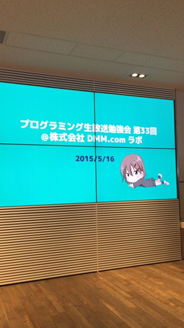
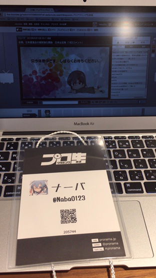
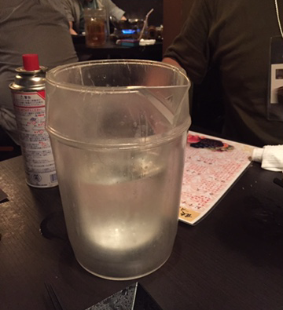
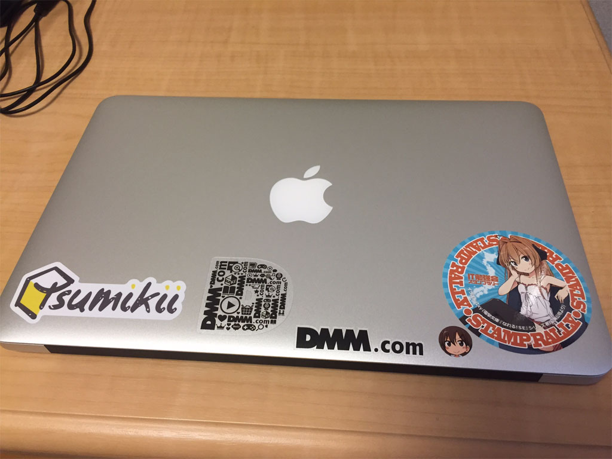

はてなブログからの移行記事

こんにちは、ナーバです。

先日 5 月 16 日に DMM.com ラボ 本社・東京事業所で行われた、<a href="http://pronama.azurewebsites.net/2015/04/10/pronama-33-at-dmm-com/">プログラミング生放送第 33 回勉強会</a>に初参加してきました！  
プロ生すげぇ！

とりあえずまとめです。

画像が小さいのは、写真を撮ったアプリのせいです。

&nbsp;

会場の DMM.com は<a href="http://gardenplace.jp/index.html">恵比寿ガーデンプレイス</a>にあります。  
恵比寿ってビールのイメージしか無くて、初めて行きましたが栄えてました（東京だから）。  
会場まで遊歩道？ があったのが印象的でした。

どうやら、<a href="http://gardenplace.jp/access/">恵比寿スカイウォーク</a>というらしいです。

&nbsp;

会場に入ると、DMM.com のロゴがドーン！ すごいところに来てしまった！  
ついでに男の娘のお姉さんがお出迎え！ すごいところに来てしまった。  
<del>Twitter で予習してきたので大丈夫でした。</del>

会場に入り、席に着く。早めに来たのかいい位置に座れました。

この画面、プロジェクターで一つの画面出だしているのではなく、4 つのディスプレイで出しているみたいです。すげぇ。

<del>途中で何度かトラブルで画面消えてましたけど。</del>

&nbsp;

買ったばかりの MacBook Air を持ち込みました。

専用の名札も貰いました。

参加無料なのに、こんなに凝っているとは…プロ生恐るべし。

というか運営の方お疲れ様です。

&nbsp;

内容は、なにか特定の技術について話すというよりも、各個人の持っている技術を、知らない人に紹介する形の方が多かった印象です。

DMM.make ROBOTS の<a href="https://robots.dmm.com/robot/palmi">Palmi</a>の紹介がとても印象的でした。
この方とは、後の懇親会の 2 次会で色々聞くことが出来ました。
技術が進めば進むほど、倫理が絡んでくるとか…。

Palmi については youtube の動画を貼っておきます。

<iframe width="560" height="315" src="https://www.youtube.com/embed/k3sPpngWFZw" frameborder="0" allow="accelerometer; autoplay; encrypted-media; gyroscope; picture-in-picture" allowfullscreen></iframe>

お値段も相当高いですが、使いこなせば新しい道が開けそう。

&nbsp;

遊び半分勉強半分で行きましたが、こういう IT 勉強会って自分の知らない知識や技術を持ってる人が、思い思いに話してくれるので、聞いてて難しいですがとっても楽しいです。

プロ生を通じて、何名かの方と仲良く？させて頂いて、ほんと嬉しい限りです。

次回プロ生が東京近辺でありましたら、LT でもしようかな！　内容どうしよう！

ともかく、プロ生ちゃん可愛いし、いい雰囲気でしたので、またお邪魔させていただきたいと思います。

その時は、またよろしくお願いします～。

## 懇親会

懇親会は、若い方からベテランの方まで多くの方とお話することが出来ました。

「響」という居酒屋でしたが、何と飲み放題ドリンクのアルコールは<strong>全てピッチャー</strong>。

全てです。ビールだけじゃないです。

日本酒だって、ほら、この通り。

良いか悪いかは別として、個性的（）なお店でした。<del>（量が少ない割に高いぞ）</del>

&nbsp;

2 次会で、これから Windows デスクトップアプリケーションを作る上での言語の相談を、SE の方にガッツリ聞くことが出来ました。

C++はやめておいて、C#をやった方がいいとのことでした。なるほど、C#か！

&nbsp;

家に帰ってシールをペタペタ。

やってみたかったんですよ！　今日だけで増えすぎてしまった。

あと、夏のボーナスが出たら Surface を買おうかなと思いました。

その際には、TAICHI21 の引き取り手を探さなくては…。
背面ディスプレイ壊れているんですけど、普通のノーパソとして誰か欲しい方いませんかねぇ。

&nbsp;

以上、レポでした！（内容についてのレポがないのはご愛嬌）
