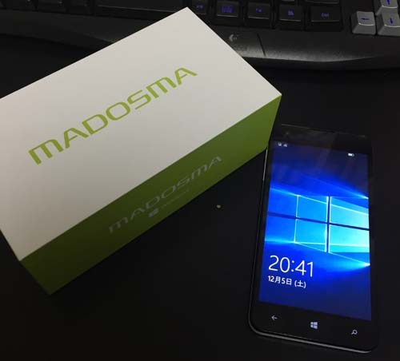
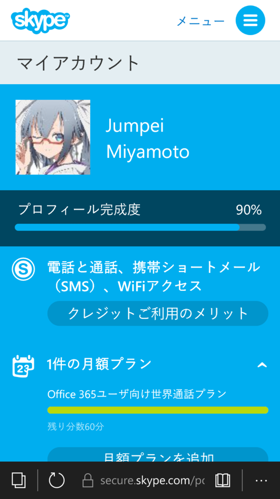
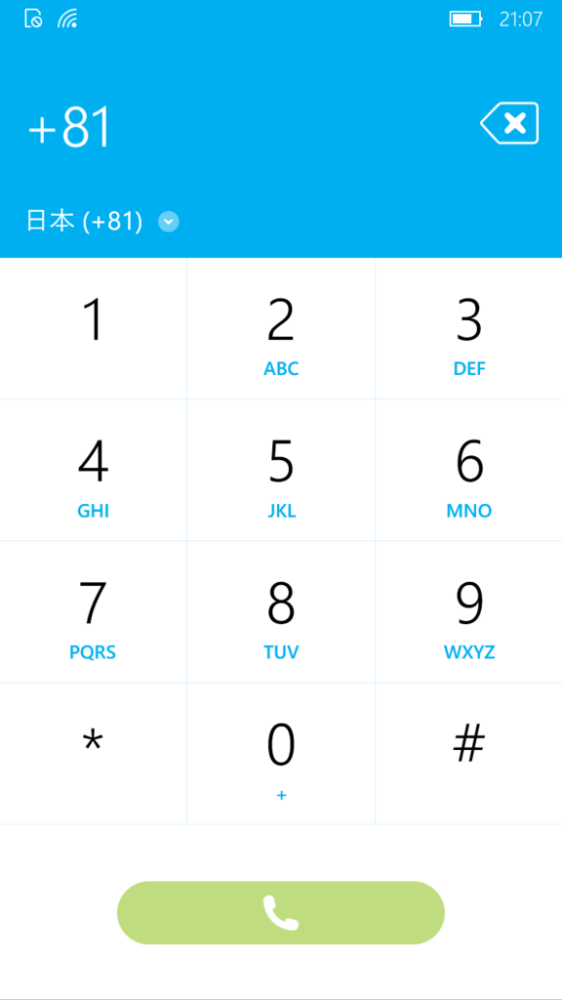
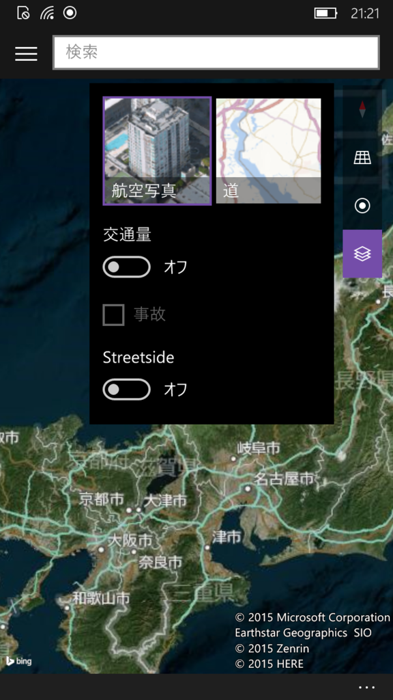
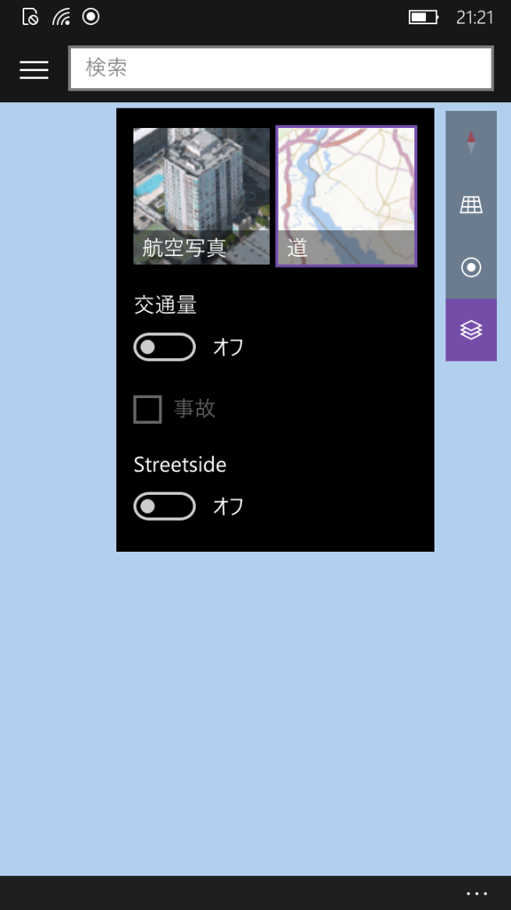

はてなブログからの移行記事

この1年でWindowsのモバイル端末が日本でも普及し始めたようで、自分も欲しくなりました。

なにやらWindows 10からは、デスクトップアプリとモバイルアプリを同時に開発できるそうで、作ってみたいですしね。

さて12月4日にマウスコンピューターがMADOSMAのWindows 10 Mobileモデルを発売したわけでさすがに発売数日では田舎のパソコン工房では在庫無いだろうなーと、淡い期待を抱きながら向かったわけですが、ありました。

<blockquote class="twitter-tweet">
あ、あった… <a href="https://t.co/3Ra0estbJV">pic.twitter.com/3Ra0estbJV</a>
&mdash; Naba (ナーバ) (@Naba0123) <a href="https://twitter.com/Naba0123/status/672999870278402048?ref_src=twsrc%5Etfw">December 5, 2015</a></blockquote> 

そして、

<blockquote class="twitter-tweet">
各位 購入しました <a href="https://t.co/zkW0McMepB">pic.twitter.com/zkW0McMepB</a>
&mdash; Naba (ナーバ) (@Naba0123) <a href="https://twitter.com/Naba0123/status/673005552532766720?ref_src=twsrc%5Etfw">December 5, 2015</a></blockquote> 

チョロい。

価格は税込み24,800円。公式ショップの楽天市場マウスコンピューター店は26,800円なので、かなりパソコン工房は頑張ってくれているみたいです。

ありがたく頂戴致します。

以下、しばらくあちこちイジってみて、やってみたこと。

### Office 365 SoloのSkypeクレジットで電話をしてみた

Office 365 Soloには毎月60分間のSkype通話が付与されています。

せっかくなので、Windows 10 MobileからSkypeクレジットを使って通話をしてみました。  
（やっていることに新規性はありませんが）

Skypeクレジットを追加できたので、次はSkypeから自分の携帯に電話をかけてみます。

そして、iPhoneで受け取ります・・・が、Skypeの番号設定をしていないので、非通知設定となっていました。

<blockquote class="twitter-tweet">
Skypeから携帯番号にかけてみた。多分番号設定してないせいで非通知になった <a href="https://t.co/3Avqq63nP7">pic.twitter.com/3Avqq63nP7</a>
&mdash; Naba (ナーバ) (@Naba0123) <a href="https://twitter.com/Naba0123/status/673112334919852032?ref_src=twsrc%5Etfw">December 5, 2015</a></blockquote> 

軽く通話テストをしてみたところ、ちゃんと時間は減っていました。

なお、Skypeアプリを起動していない間は、オンラインステータスは退席中となるようです。  
その場合でも、バックグラウンドで動いているのか、Skype内の通話を着信することが出来ました。

 

### その他気になった点

数時間触ってみたMADOSMA及びWindows 10 Mobileの感想

#### Siriに慣れすぎていたのか、Cortanaは少し物足りないかもしれない

日本語の認識力は試した限りでは問題無さそうでした。  
Siriは、内容が理解できない場合に「理解できませんでした。Webで検索しますか」と言ってくれますが、Cortanaは有無を言わずBing検索結果を出します。  
構わないですけどね。

#### マップアプリが衛星写真以外出せない？

公式のマップアプリが、衛星写真ではちゃんと表示されるのに、2次元地図にすると真っ青の海でした。日本の地図は無いのかな。

2015/12/6追記：しばらくした後にやり直したらちゃんと標準地図も表示出来ました。

なお、MADOSMAの下の3つのボタン「←」「田」「🔎」ですが、  
それぞれ  

* 「←」タップ：ひとつ前の画面（またはアプリ）に戻る
* 「←」長押し：起動中アプリ一覧を開く（ここでアプリを下にスワイプするとアプリと閉じれる）
* 「田」タップ：スタート画面に戻る
* 「田」長押し：画面半分から上の領域を下に持ってくる（iOSにもこんな機能ありますよね）
* 「🔎」タップ：Cortanaトップ、この画面で登録したアプリの情報を見ることが出来ます（説明できない）
* 「🔎」長押し：Cortanaに直接音声入力をする

が出来ます。

まだまだ知らないことばかりですが、Windwso 10 Mobile、仲良くしていきたいです。
