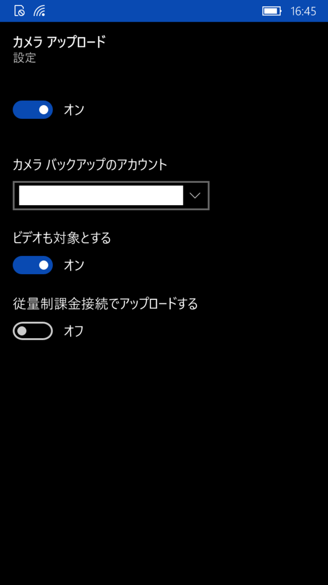
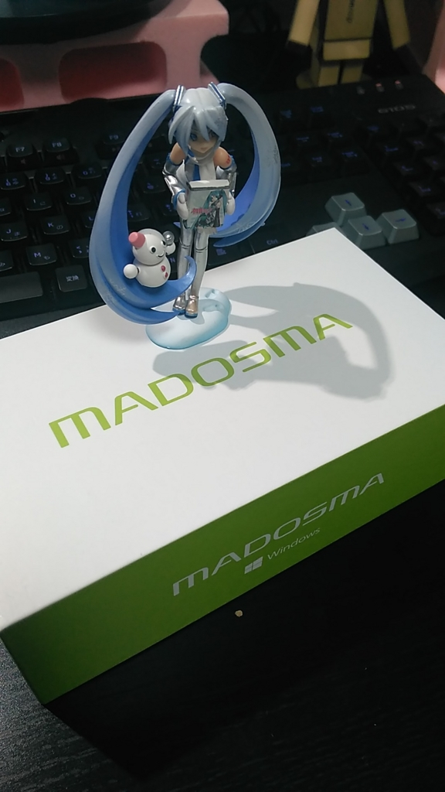

はてなブログからの移行記事

Windows 10 Mobile に限った話ではありませんが、  
OneDrive には撮った写真を OneDrive に自動でアップロードするという機能があります。

撮った写真が自動で PC に同期されると便利なので、使います。

# 設定方法

OneDrive の設定から `カメラ アップロード` を選択

「オン」にします。  
お好みで `ビデオも対象とする` や `従量制課金接続でアップロードする` にチェックを入れます。

設定は以上です。

# 使ってみる

写真を撮ると、しばらく（自分の場合１分～３分）したあと後に、写真が OneDrive にアップロードされます。

OneDrive のメニューから「進行状況」を確認。

カメラタブで「現在アップロードしているファイルはありません。」となっていますが、

アップロード中はこのような表示になって、すぐにアップロードは終わりました。

アップロードが始まるまでは時間がかかりますが、アップロード自体はすぐに終わり、  
PC の OneDrive にもすぐに同期されました。

### アップロード先

アップロードされたものの、どこにアップロードされたのか分からないため手探りでアップロード先を探していましたが、  
私の環境では `private\Pictures\Camera Roll` にアップロードされていました。

アップロード先の設定方法があったら教えて下さい。

MADOSMA にて撮影。  
iPhone と比べると画質が少し悪いような気がしなくもないですが、価格を考えれば文句はないです。
