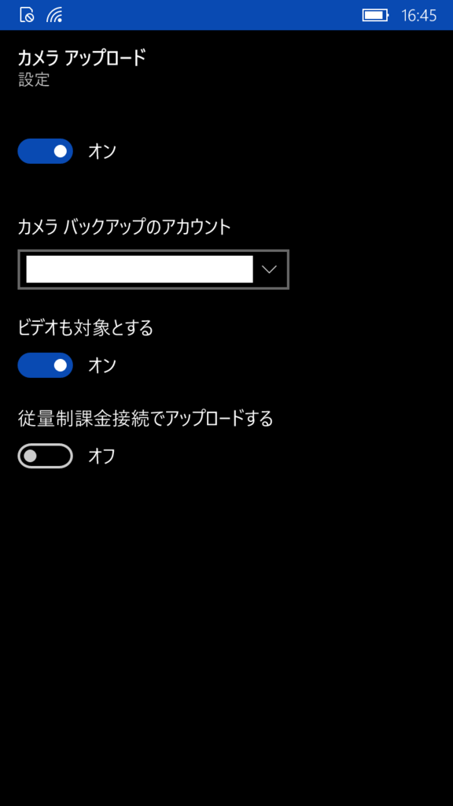

はてなブログからの移行記事

Windows 10 Mobileに限った話ではありませんが、  
onedriveには撮った写真をonedriveに自動でアップロードするという機能があります。

撮った写真が自動でPCに同期されると便利なので、使います。

 

### 設定方法

onedriveの設定から「カメラ アップロード」を選択

「オン」にします。  
お好みで「ビデオも対象とする」や「従量制課金接続でアップロードする」にチェックを入れます。

設定は以上です。

 

### 使ってみる

写真を撮ると、しばらく（自分の場合１分～３分）したあと後に、写真がonedriveにアップロードされます。

onedriveのメニューから「進行状況」を確認。

カメラタブで「現在アップロードしているファイルはありません。」  
となっていますが、

アップロード中はこのような表示になって、すぐにアップロードは終わりました。

 

アップロードが始まるまでは時間がかかりますが、アップロード自体はすぐに終わり、  
PCのonedriveにもすぐにDLされて同期されました。

 

### アップロード先

アップロードされたものの、どこにアップロードされたのか分からないため手探りでアップロード先を探していましたが、  
私の環境では**「private\Pictures\Camera Roll」**にアップロードされていました。

アップロード先の設定方法があったら教えて下さい。

MADOSMAにて撮影。  
iPhoneと比べると画質が少し悪いような気がしなくもないですが、価格を考えれば文句はないです。

 
