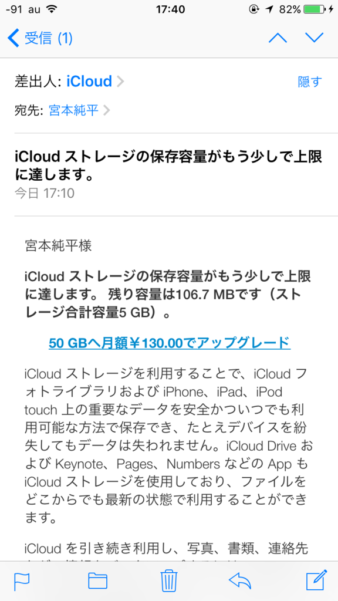
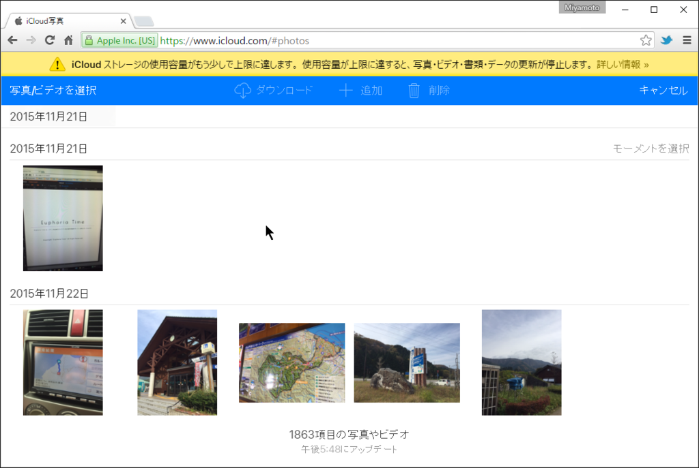
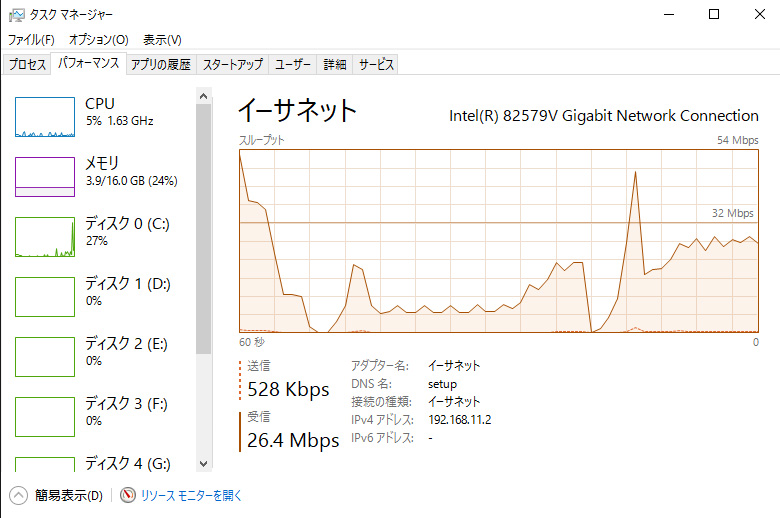
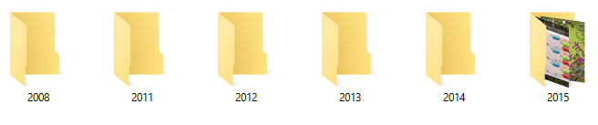
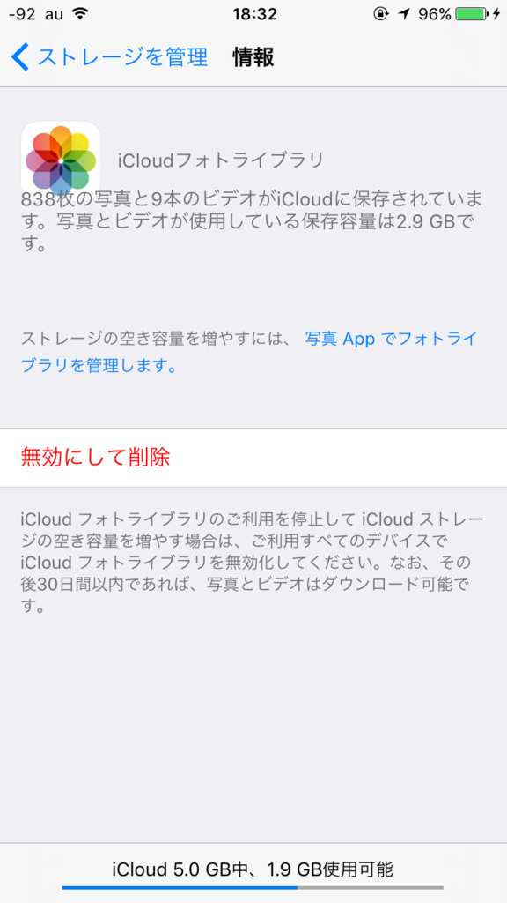
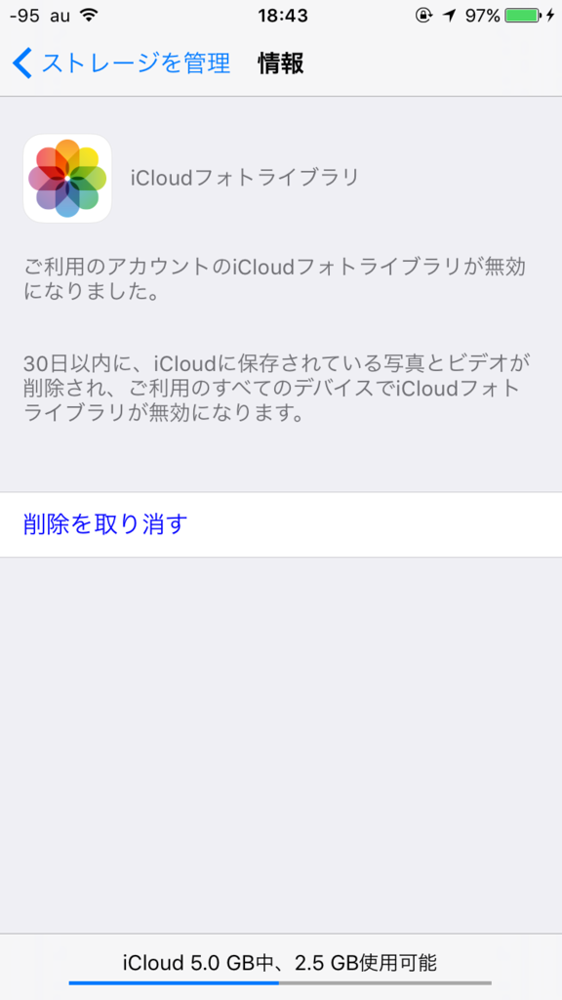

はてなブログからの移行記事

# 導入

iPhone で撮影した写真・動画を iCloud へ自動アップロードするようにしていたら、こんなメールが届きました。

iPhone から iCloud へのアップロードは自動停止してました。

iCloudの仕組みが少々ややこしくて（と自分で思っているだけかもしれないが）、iPhoneの内部容量を空けるためにサムネイルだけをiPhoneに保存、実際の写真はiCloudへ保存となっているみたいです。

なので、iPhoneをPCに繋いでバックアップしようとしても、iCloudに本体が保存されている写真などはiPhoneから転送が出来ないようです。

そしてiCloudへのアップロードが自動停止した後にもiPhoneで写真を撮り続け、いよいよiPhone側の容量も一杯になってしまったので、これを機にiCloudから全写真・動画をDLしてみることにしました。

# ブラウザからはまとめてDL出来なかった

[https://www.icloud.com/](https://www.icloud.com/) にアクセスすれば写真や動画をダウンロードすることが出来ますが、まとめて選択が出来ないみたいです。

一つひとつダウンロードするのは手間がかかるので、別の方法を探すことに。

## iCloud for Windowsをインストールした

結局、iCloud for Windowsをインストールして、同期されるのを待つことにしました。

インストールしてApple IDを認証した瞬間、トーストが鳴ります。

しかもこれ、なかなかの頻度で来ます。10分に1回ぐらい。  
今この記事を書いている間にも何度か来ました。

セットアップが完了すると、後は同期されるのを待つだけ。

デフォルトの同期先は `User\Pictures\iCloud Photo\Downloads` で、年別にフォルダが別れてダウンロードされていました。

 

## iCloud上からコンテンツを削除して容量をあける

iCloudとiPhoneのフォトストリームが連携しているので、後はiPhone側から不要な写真と動画を削除すれば、iCloudからも自動的に削除されます。

ただし、私のようにiCloudにアップロードされていないiPhone内のコンテンツがある場合、そちらも間違って削除しないように気をつけて下さい。

ダウンロードされた最新の画像を見て、それ以前のコンテンツを削除しましょう。

 

また、iPhone内の容量は放っておいてiCloudの写真・動画だけをまとめて削除したい場合には、iPhoneから「iCloud」→「容量」→「ストレージを管理」→「iCloudフォトライブラリ」→「無効にして削除」を押せば一括して削除出来ます。バックアップをとってから削除をしましょう。

これをオフにすると、30日以内に削除されるようです。猶予長い。

