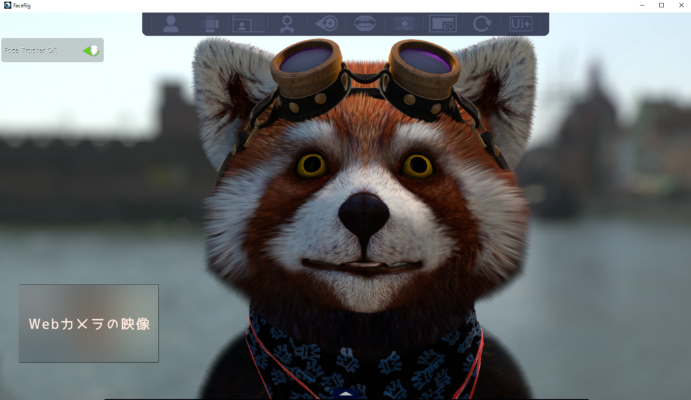
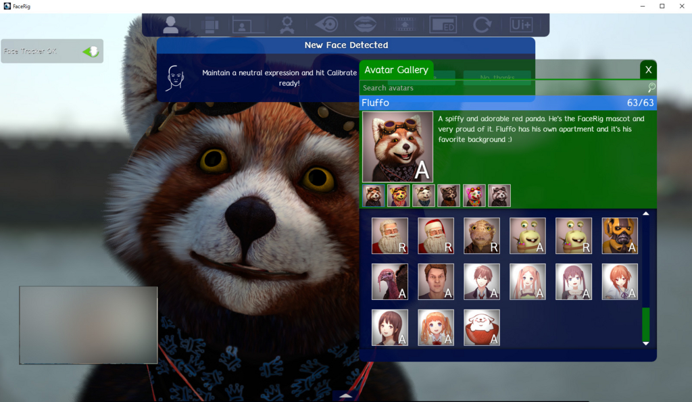
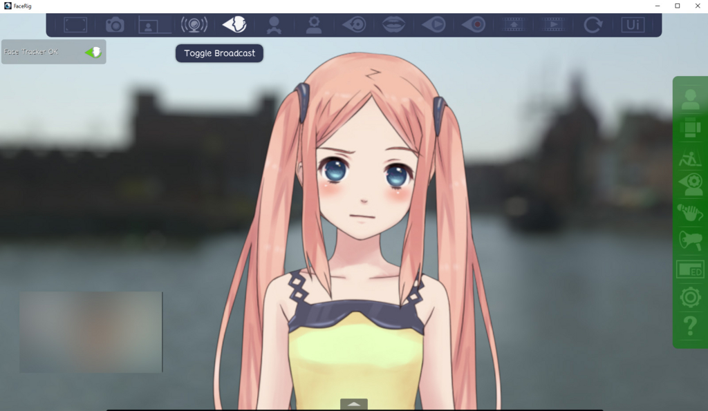

はてなブログからの移行記事

最近話題となっているFaceRig Live2D Module。  
Webカメラから顔を認識して画面内の3Dキャラクターが同じ表情をしてくれるFaceRigというソフトのDLCですが、調べてみたら思ったよりも安かったので、本体のFaceRigと共につい買ってしまいました。

Steam上で配信されています。

* [http://store.steampowered.com/app/274920/](http://store.steampowered.com/app/274920/)
* [http://store.steampowered.com/app/420680/](http://store.steampowered.com/app/420680/)

# インストール

SteamからFaceRigをインストールすれば完了です。  
Skypeで使いたい場合は、仮想Webカメラドライバが必要なので、キャンセルを押さずにちゃんとインストールしましょう。

# キャラクター選択

起動するとこんな画面が出ます。  
デフォルトのたぬきの毛のふわふわ感に驚きます。

左上の人の形のアイコンをクリックすると、キャラクター選択画面になります。  
FaceRig Live2D Moduleを購入しているのならば、一番下に追加キャラクターが表示されているので、お好みのキャラクターを選択しましょう。

<blockquote class="twitter-tweet">
話題のアレ買った。新境地に達した気がする <a href="https://t.co/UaiRyUhZqH">pic.twitter.com/UaiRyUhZqH</a>
&mdash; Naba (ナーバ) (@Naba0123) <a href="https://twitter.com/Naba0123/status/677810506527211520?ref_src=twsrc%5Etfw">December 18, 2015</a></blockquote> 

# 上手く顔を認識させるコツ

## カメラに顔全体がちょうど入るようにする
上の動画では目の動きが少し不自然ですが、これはカメラに遠かったせいでもあります。  
カメラから遠ざかればそれだけ目の認識範囲が狭まって、誤認識をする可能性が出るようです。

なお近すぎても顔の輪郭を認識しなくなるので気をつけましょう。

## 表情豊かに
ここまで完成度の高いソフトであっても、完璧ではありません。  
例えば、まつ毛が長かったり目が細めたりすると、ご認識される可能性が上がります。

上手く認識するためには、感情豊かな表情をすることをオススメします。例え一人でも。

# SkypeのWebカメラとして使う

* 先にFaceRigを起動しておきます。
* 右上のアイコン「Switch to Advanced UI」をクリックします。  

* すると、上と横にアイコンが追加され、上に「Toggle Broadcast」があるのでクリックします。
* 後はSkypeのビデオ設定からFaceRigのインストール時にインストールした仮想Webカメラ「FaceRig Virtual Camera」を選択すれば終わりです。

<blockquote class="twitter-tweet">
可愛い <a href="https://t.co/PW7ozGrYkB">pic.twitter.com/PW7ozGrYkB</a>
&mdash; Naba (ナーバ) (@Naba0123) <a href="https://twitter.com/Naba0123/status/678526663357894659?ref_src=twsrc%5Etfw">December 20, 2015</a></blockquote> 

# その他

他にも、マイクから拾った音声を認識して自動で口を動かさせたり、背景を変更などかなり設定が細かいので、夢が広がりますね。

 

なお、この笑顔のスクリーンショットを撮ったり、実際に動いている様子を撮影している時の、Webカメラに写っている自分の姿を見るのは、とても辛くなるのでやめましょうね。  
慣れてくれば認識画面（左下の自分のWebカメラの映像）を見なくても良くなるので、設定でオフにも出来ます。
