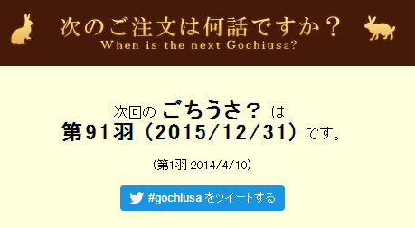

はてなブログからの移行記事

「次のご注文は何羽ですか？？」という Web アプリケーションを作成しました。

# 概要

簡単なWebアプリケーション…とまでも言うものでもないです。

「ご注文はうさぎですか？」の放送開始日を基準として、そこから何週間経ったかを計算し、次は何日に何羽が放映されるのかを知ることが出来ます。

巷ではきんモザやキルミーベイベーの実況が未だに続いているようなので、ごちうさも負けてはいけませんね。

# 内容

## 計算

`gist:anonymous/0373011a1236483b7ec9`

JavaScript書けないマンなので、変な処理があったらごめんなさい。

## ロゴ

うさぎのフォントがあります。可愛いですね

[http://www.dafont.com/lp-rabbits-1.font](http://www.dafont.com/lp-rabbits-1.font)

配色は公式のロゴから拝借しました。そのおかげで、適当なデザインでもそれっぽく見えてます。

# 最後に

ところで今日12月26日は二期の最終回（？）ですが、大晦日には一期の第91羽です。楽しみにしましょう！

