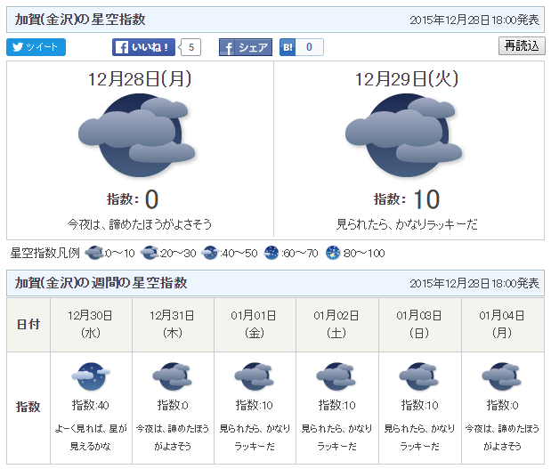
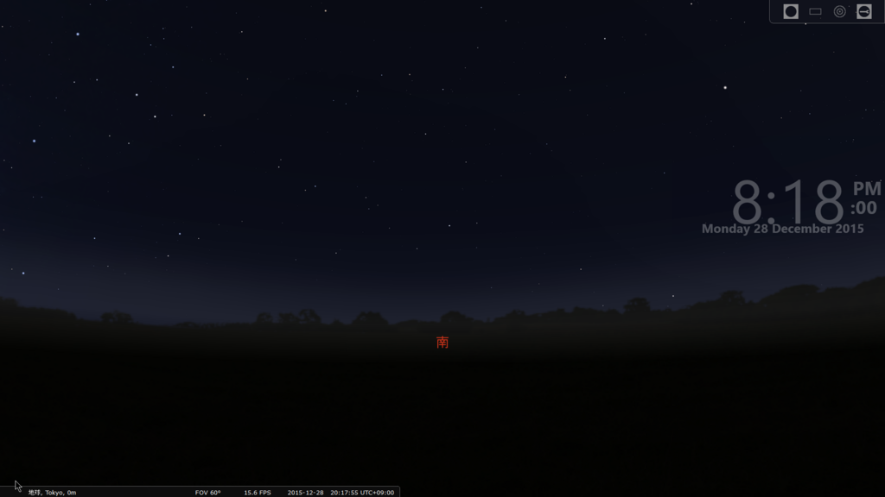
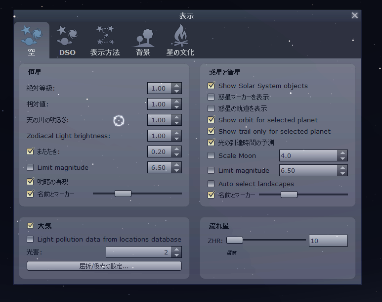
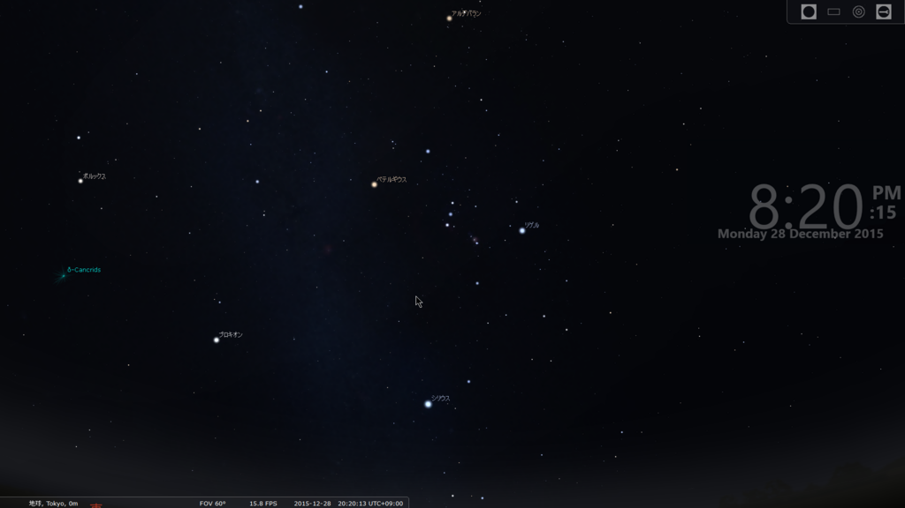
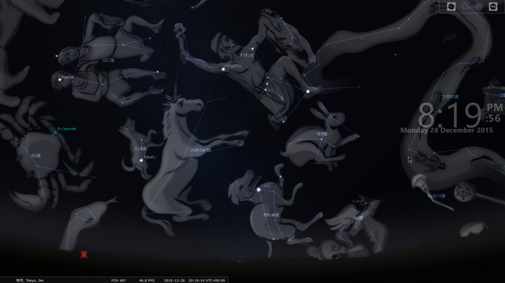
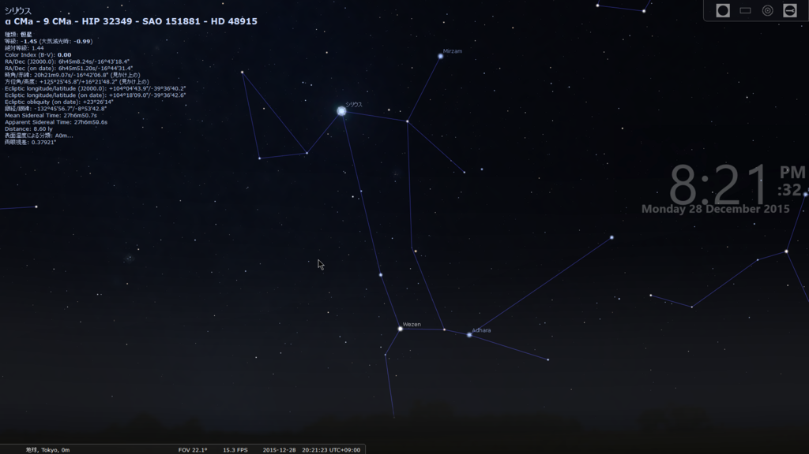
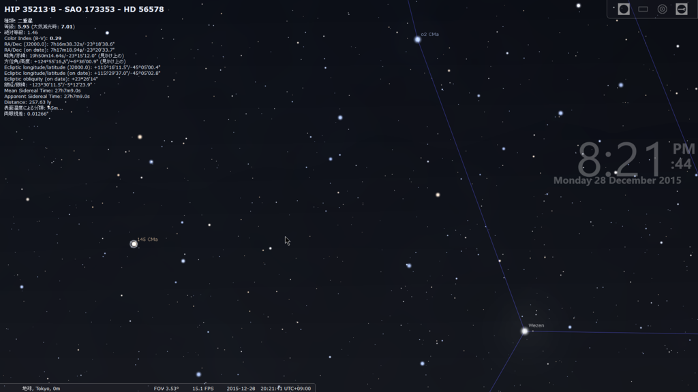
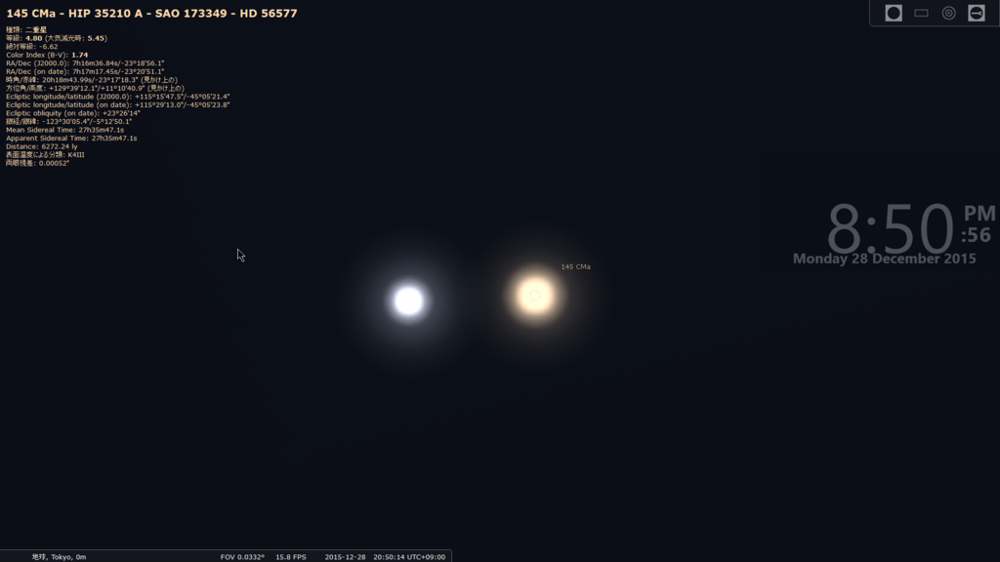
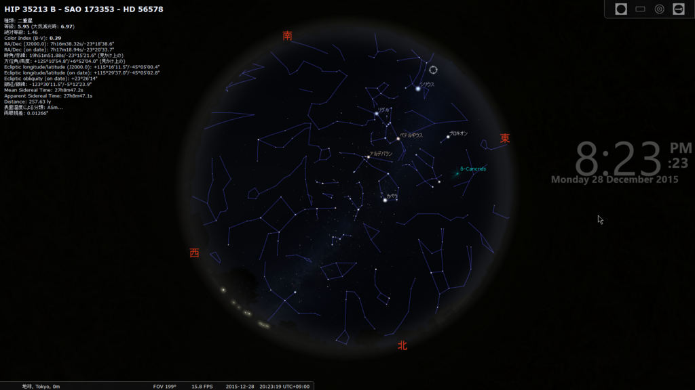

はてなブログからの移行記事

最近、仕事終わって帰るときに空を見上げる癖が出来ました。  
そして、「今日もやっぱり星は観えないか～」と落胆します。

北陸は晴れないのです。

[http://www.tenki.jp/indexes/starry_sky/](http://www.tenki.jp/indexes/starry_sky/)

 

でもどうしても星を観たくて調べると、オープンソースプラネタリウム、stellariumというものを見つけました。

[http://www.stellarium.org/ja/](http://www.stellarium.org/ja/)

 

どうして急に星を観たくなったのかは置いておいて、鉄は熱いうちに打てと云いますし、使い方を紹介します。

この記事を読んで、少しでも星に興味を持つ人が増えますように。

 

# stellarium

stellariumをインストールして起動すると、こんな画面が出ます。

このままグリグリするだけでも楽しいです。

下のメニューバーを見ると、地球上のどこの位置から、何時に見れる星空を表示しているのかが分かります。

左下からにょきっと出てくるメニューの設定ボタンから日本語化できます。

また、F6を押すと現在位置を変更することができるので、「Tokyo」にしてみましょう。

 

## 夜空を楽しむ

まず、stellariumではデフォルトで月を表示するようになっています。

ご存知の方も多いと思いますが、月というのはかなり天体観測に影響をしていて、満月の時の星空と、新月の時の星空はかなり違います。  
月の明るさで他の星が見えづらくなってしまうので、星空を楽しみたい場合は、新月が良いみたいですよ。  
覚えておきましょう。

 

stellariumでは、月及び太陽を非表示にすることが出来ます。

F4を押して、右上の「Show Solar System objects」のチェックを外しましょう。

そして東の空（12月28日20時の場合）を見ると、普段なら滅多に見ることが出来ない**冬の天ノ川**を拝めます。

この画像内の「オリオン座のベテルギウス」「おおいぬ座のシリウス」「こいぬ座のプロキオン」を結ぶと、**冬の大三角形**になります。  
冬の天ノ川を挟んでいるなんて、ロマンチックですねぇ。

 

## 星座を観る

12月28日の午後8時の東の空を見ると、ちょうど有名なオリオン座などが登っている状態です。

下のメニューから星座線と星座名、それと星座絵を表示してみましょう。

少しカオスですが、こんな感じです。

 

星座神話の話をすると長くなるので今回は割愛しますが（私自信詳しくないですが）、星座の位置や絵の向きなどと密接に関わっていて、なかなか面白いです。

例に、オリオン座の神話を載せておきます。

うさん臭いまとめさいと風に書くと、  
「**アポロン『オリオンが妹とイチャついてうざいから、妹を騙して殺してもらったったwwwwww』**」  
というところでしょうか。

アポロン許すまじ。

[オリオン座の神話](http://www.din.or.jp/~t-sugi/star/4seiza2/51orion.htm)

 

## 冬のアルビレオ

全く有名ではありませんが、最近知った綺麗な星をご紹介します。

おおいぬ座のシリウスからの図から追っていきます。

シリウスから下に下がって2つの星を頂点に正三角形を左向きに結んだところに、おおいぬ座145番星(h3945)という星があります。

この星、一見ただの星ですが、見かけ上二重に見える「二重星」と呼ばれる星です。  
しかも、橙色と水色の美しい色。魅了されます。

[http://www5d.biglobe.ne.jp/~Lyr/Tour/WS-fuyu.htm:title]

かなり拡大すればこのぐらい綺麗に分かれています。

 

アルビレオといえば、有名なのは「銀河鉄道の夜」にも登場する「はくちょう座β星」ですが、冬のアルビレオも負けてはいません。

肉眼で二重に見えることは不可能ですが、比較的見つけやすい場所の星だと思うので、是非見つけてみてください。

 

## 流れ星

さて、stellariumは流れ星を流すことも出来ます。

F4を押して設定画面を出し、右下の「流れ星」の数を右へ動かしてみましょう。

表示されている数字が1時間あたりの流れ星の数だと思われます。

かなりの数に設定すると、待たずとも流れ星を確認できますね。  
眺めているだけでも心が安らぎます。

 

## まとめ

いかがでしょうか。無料とは思えないクオリティです。  
さすがオープンソースといったところでしょうか。

 

stellariumには、まだまだ隠された機能がたくさんあります。

時間を早めたり進めたりすることはもちろん、望遠鏡のエミュレータや背景の変更、スクリプトを組んで星空を動かせたりするようです。

 

ここ数年、はやぶさだったりISSだったり、宇宙に関するニュースが多くてワクワクしますね。

これを機に、星空を見て星座を見つけられる、しかも神話を語れるなんて言ったら、注目を浴びるかもしれませんよ。

 

 

というか、マジ北陸晴れないのな……。

 

 
