

はてなブログからの移行記事

先月 MADOSMA を買いましたが、まだ Visual Studio すら立ち上げていない状態だったので、そろそろ開発環境の構築をしておきます。

偉大なる **かずあき** さんのブログを参考にさせて頂きました。

[http://blog.kazuakix.jp/entry/2015/06/20/215827](http://blog.kazuakix.jp/entry/2015/06/20/215827)

上の記事は Windows Phone 8.1 での記事だったので、Windows 10 / Windows 10 Mobile での方法をメモします。

# Visual Studio 2015 Communityのインストール

Community エディションは、個人開発であれば Professional 相当の機能が無料で使えます。

[https://www.microsoft.com/ja-jp/dev/products/community.aspx](https://www.microsoft.com/ja-jp/dev/products/community.aspx)

# 開発のための開発者ロック解除(PCから)

参考記事の通り(Windows Phone 8.1)に以下の方法でやってみましたが、次のセクションで紹介しているように、Windows 10 Mobile からは端末から開発者ロック解除が出来るかもしれません。

 

Visual Studioをインストールすると、**Windows Phone Developer Registration** が同時にインストールされる（と思う）ので、起動します。

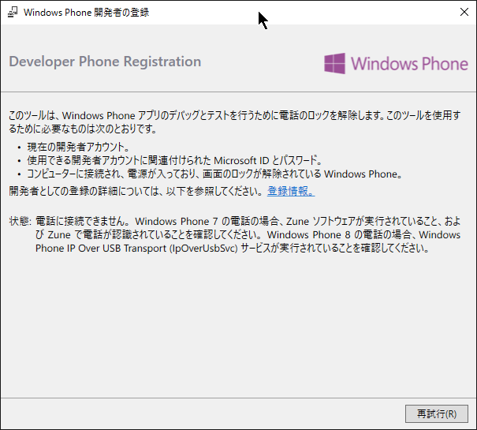

電話に接続しろと言われるので、MADOSMAをUSBでPCへ接続します。

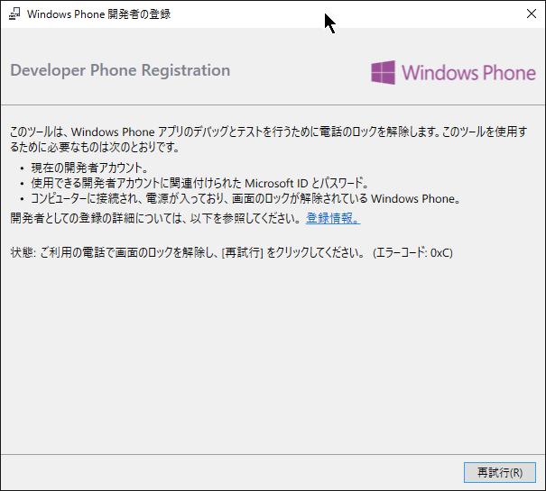

画面のロックを解除しろと言われるので、解除しておきます。

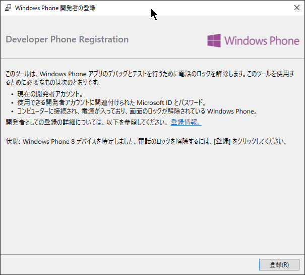

何故か「Windows Phone 8」を検知されていますが、気にせず「登録」をクリック。  
Microsoftアカウントを入力し、登録完了です。

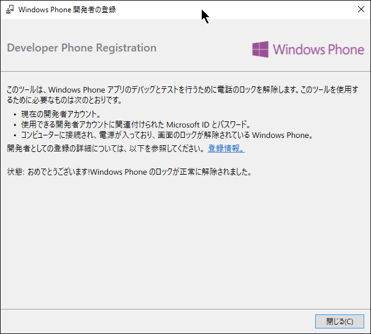

 

## 開発のための開発者ロック解除（端末側から）（動作未確認）

Windows 10 Mobile 上で設定項目を探していたら、開発者モードに切り替えるボタンがあったので、ここからも解除が出来るかもしれません。  
なお、私は Windows Phone 8.1 端末を持っていないので、そちらでこの設定項目があるかは分かりません…。

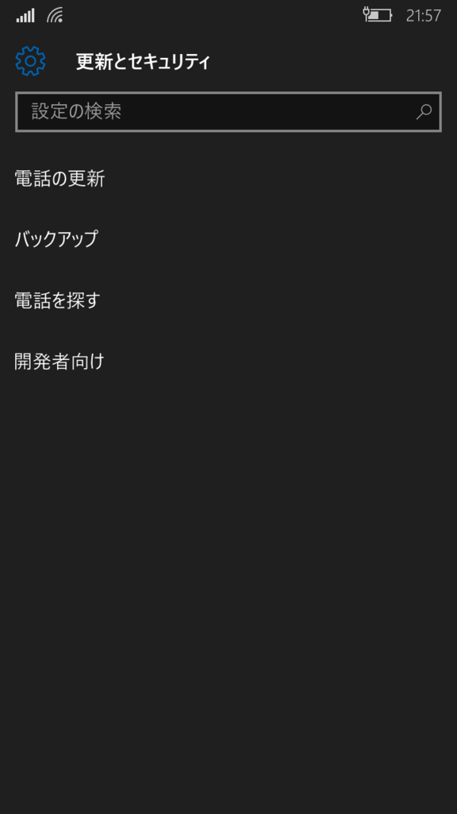

`設定` → `更新とセキュリティ` → `開発者向け`

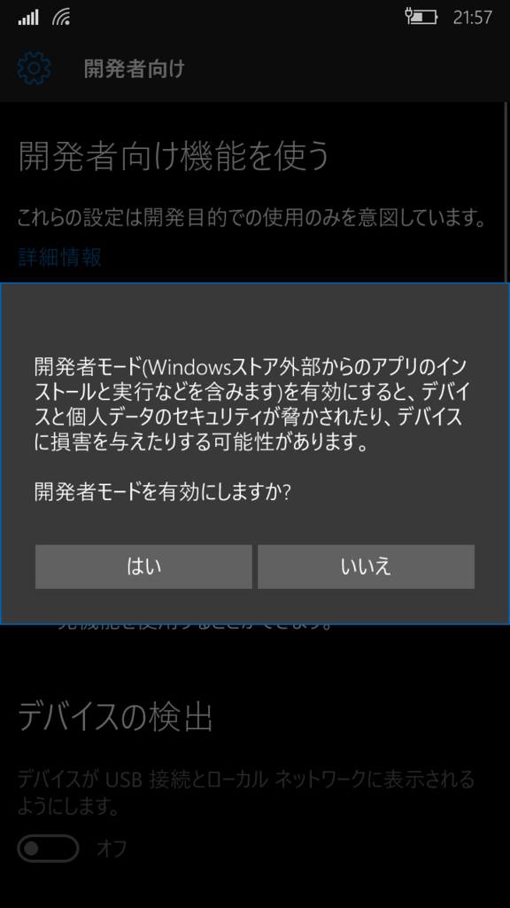

開発者モードに切り替えようとすると上のようなポップアップが出るので、「はい」をタップ。

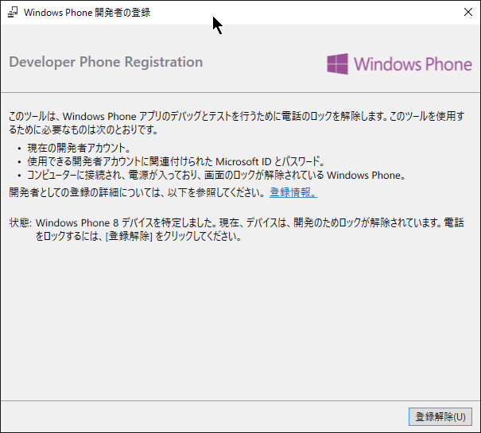

この状態で Windows Phone Developer Registration を起動すると、上のように出ます。  
PCからロック解除してもこの表記になるので、恐らく Windows 10 Mobile 上からでもロック解除が出来るかと思います。

## サンプルアプリを動かす

折角 Windows 10 Mobile なので、UWP アプリを MADOSMA で実行してみます。

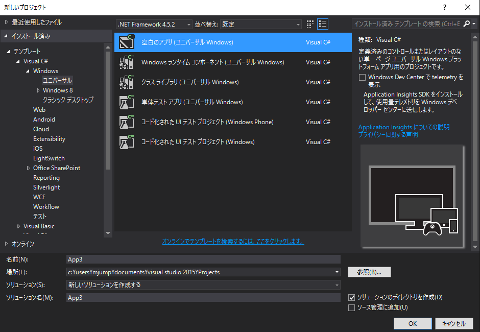

新しいプロジェクトから、「空白のアプリ（ユニバーサル Windows）」を選択して作成します。

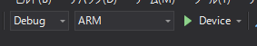

デバッグ設定を「Debug」「ARM」「Device」にして、実行します。

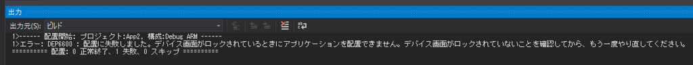

MADOSMAの画面がロックされた状態だと、エラーが出ます。  
ロックを解除します。

初回は、ライブラリの配置などでしばらく時間がかかり、しばらくするとMADOSMA上でアプリが実行されます。

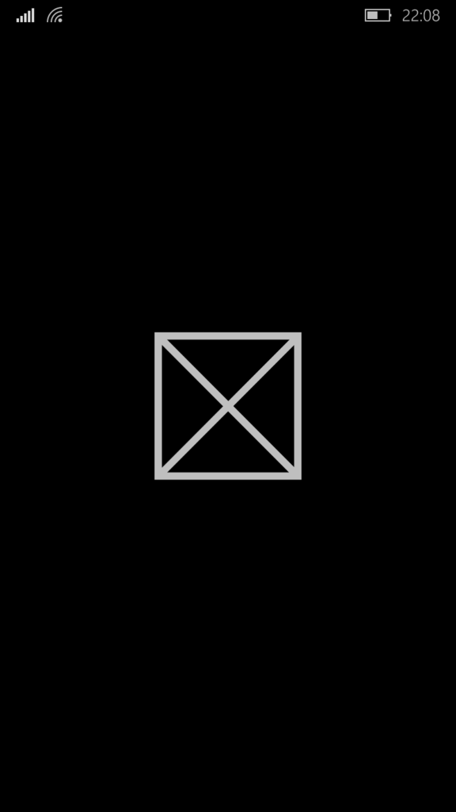

ひとまず実行まで出来ました。

あれこれの勉強はこれからしていきます。おわり。
