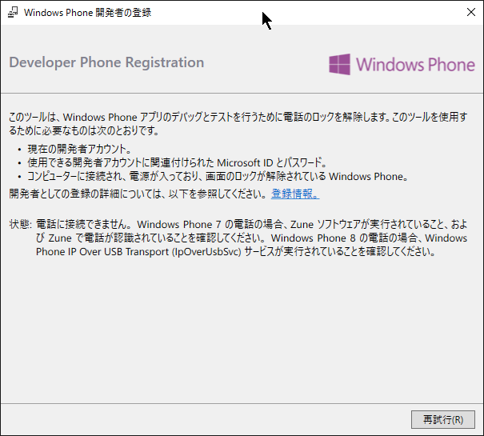
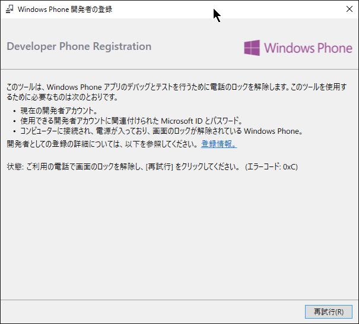
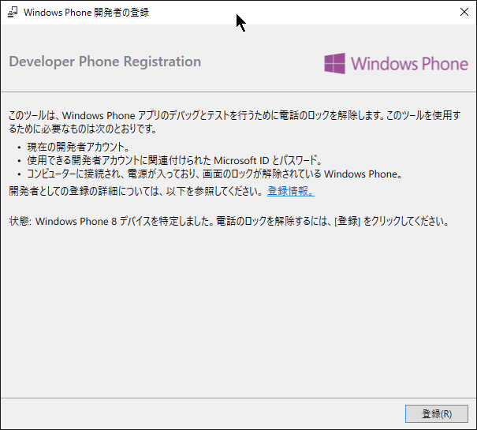
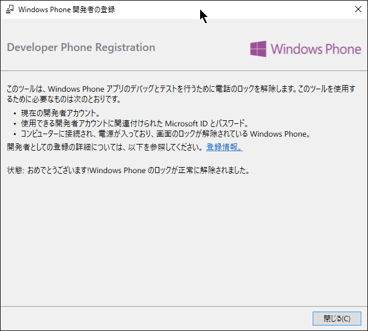
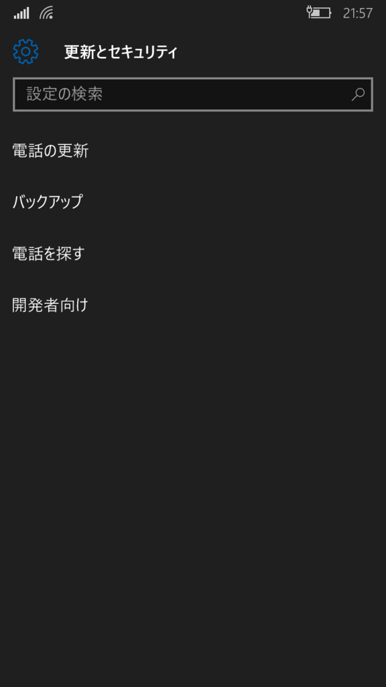
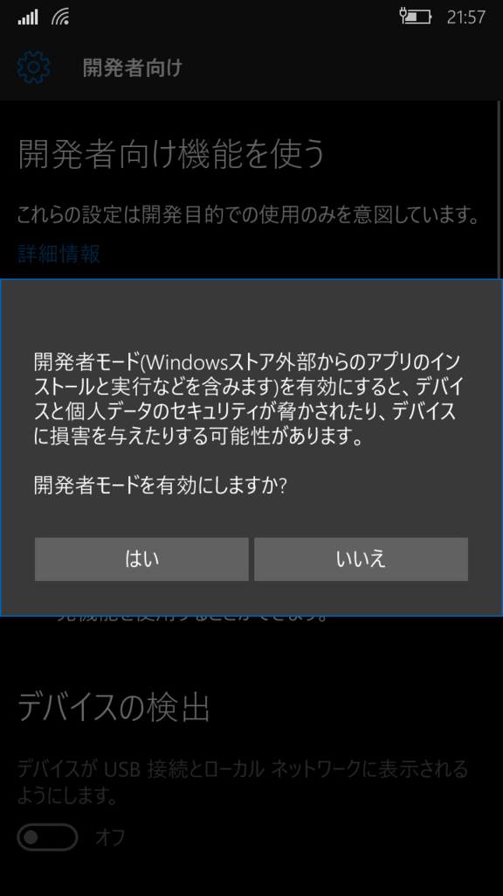
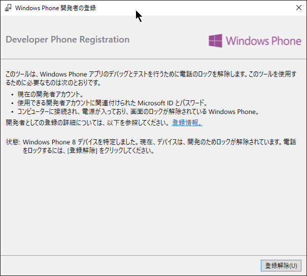
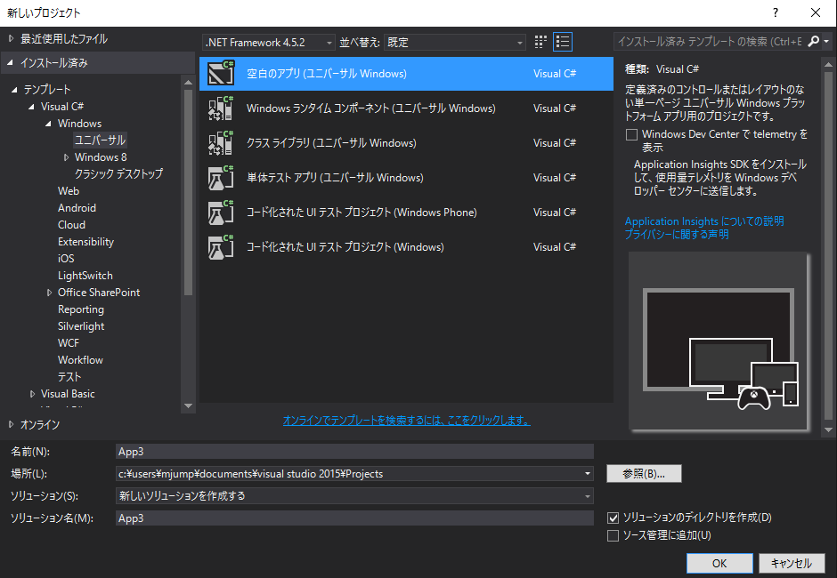
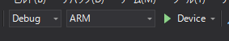
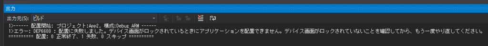

はてなブログからの移行記事

先月MADOSMAを買いましたが、まだVisual Studioすら立ち上げていない状態だったので、そろそろ開発環境の構築をしておきます。

偉大なる**かずあき**さんのブログを参考にさせて頂きました。

[http://blog.kazuakix.jp/entry/2015/06/20/215827](http://blog.kazuakix.jp/entry/2015/06/20/215827)

上の記事はWindows Phone 8.1のMADOSMAでの記事だったので、Windows 10 / Windows 10 Mobileでの方法をメモします。

 

## Visual Studio 2015 Communityのインストール

Communityエディションは、個人開発であればProfessional相当の機能が無料で使えます。

[https://www.microsoft.com/ja-jp/dev/products/community.aspx:embed]

 

## 開発のための開発者ロック解除(PCから)

参考記事の通りに以下の方法でやってみましたが、Windows 10 Mobileからは端末から開発者ロック解除が出来るかもしれません。詳細は次のセクションで

 

Visual Studioをインストールすると、**Windows Phone Developer Registration** が同時にインストールされる（と思う）ので、起動します。

電話に接続しろと言われるので、MADOSMAをUSBでPCへ接続します。

画面のロックを解除しろと言われるので、解除しておきます。

何故か「Windows Phone 8」を検知されていますが、気にせず「登録」をクリック。  
Microsoftアカウントを入力し、登録完了です。

 

## 開発のための開発者ロック解除(MADOSMA上から、未確認)

Windows 10 Mobile上で設定項目を探していたら、開発者モードに切り替えるボタンがあったので、ここからも解除が出来るかもしれません。  
なお、私はWindows Mobile 8.1端末を持っていないので、そちらでこの設定項目があるかは分かりません…。

「設定」→「更新とセキュリティ」→「開発者向け」

開発者モードに切り替えようとすると上のダイアログ？が出るので、「はい」をタップ。

この状態で**Windows Phone Developer Registration**を起動すると、上のように出ます。  
PCからロック解除してもこの表記になるので、恐らくWindows 10 Moile上からでもロック解除が出来るかと思います。

 

## サンプルアプリを動かす

折角Windows 10 Mobileなので、UWPアプリをMADOSMAで実行してみます。

新しいプロジェクトから、「空白のアプリ（ユニバーサル Windows）」を選択して作成します。

デバッグ設定を「Debug」「ARM」「Device」にして、実行します。

MADOSMAの画面がロックされた状態だと、エラーが出ます。  
ロックを解除します。

初回は、ライブラリの配置などでしばらく時間がかかり、しばらくするとMADOSMA上でアプリが実行されます。

 

 

ひとまず実行まで出来ました。

あれこれの勉強はこれからしていきます。おわり。

 
