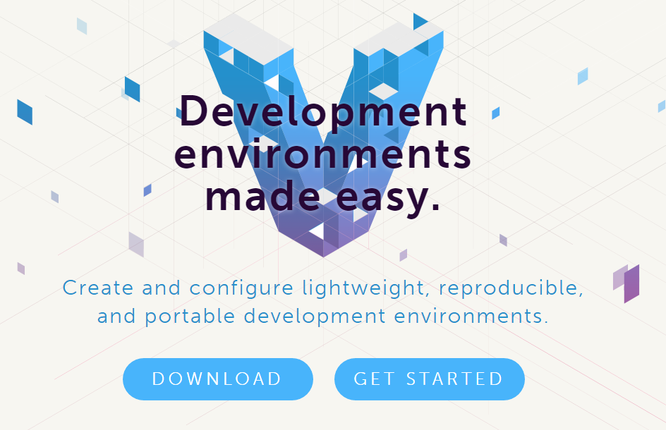
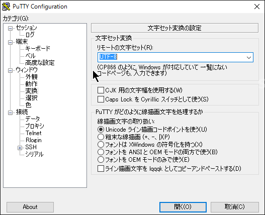

<div class="alert info">
はてなブログからの移行記事
</div>

# 環境構築したもの

## Windows 10 Home 側

- Vagrant
- VirtualBox

## 仮想環境側

- CentOS 7.0 x86_64
- Apache 2.4.6
- MySQL 5.7.10
- PHP 7.0.2

# Vagrant について

これを使うと VirtualBox の設定画面をいちいち弄ったり、ゲスト OS を手動でインストールしなくて済みます。



[https://www.vagrantup.com/](https://www.vagrantup.com/)

# VirtualBox

仮想環境自体を管理するソフトウェアです。

[https://www.virtualbox.org/](https://www.virtualbox.org/)

今回は、最新版の 5.0 を使用しています。

# Vagrant の設定

- コマンドプロンプトを立ち上げて、仮想環境のフォルダを作成します。

```
mkdir centos
cd centos
```

続けて、以下のコマンドを実行

```
vagrant box add CentOS https://f0fff3908f081cb6461b407be80daf97f07ac418.googledrive.com/host/0BwtuV7VyVTSkUG1PM3pCeDJ4dVE/centos7.box
vagrant plugin install vagrant-vbguest
```

1 行目は、vagrant の box を指定。以下から目的の box を探して下さい。

[http://www.vagrantbox.es/](http://www.vagrantbox.es/)

2 行目は、VirtualBox の Guest Additions を使用するためのプラグインで、私の環境ではインストールしないとエラーが出ました。

[http://qiita.com/isaoshimizu/items/e217008b8f6e79eccc85](http://qiita.com/isaoshimizu/items/e217008b8f6e79eccc85)

<br>

仮想環境を作成します

```
vagrant init CentOS
notepad.exe Vagrantfile
```

メモ帳でコンフィグファイルが開くので、以下のように設定

```
Vagrant.configure(2) do |config|
  config.vm.box = "CentOS7"
  config.vm.network "private_network", ip: "192.168.33.10" (←コメントアウトを外す)
  config.vm.synced_folder "../hello", "/var/www/html/hello" (←お好みで設定、後述)
  config.vm.provider "virtualbox" do |vb| (←コメントアウトを外す)
    vb.memory = "1024" (←コメントアウトを外す)
  end (←コメントアウトを外す)
end
```

`config.vm.synced_folder`は、CentOS と Host の共有フォルダになります。  
上記の場合だと、ホストの`../hello`フォルダと、ゲストの`/var/www/html/hello`フォルダが共有されることになります。

<br>

設定は以上です、仮想環境を起動します。

```
vagrant up

vagrant halt (←停止するとき)
vagrant reload (←再起動するとき)
```

# SSH で接続

起動したので、SSH で接続します。  
Windows にはコマンドラインで使える SSH クライアントがデフォルトでは存在しないので、今回は putty を使います。

[http://www.chiark.greenend.org.uk/~sgtatham/putty/](http://www.chiark.greenend.org.uk/~sgtatham/putty/)

- ホスト名：192.168.33.10
- ポート番号：22



文字コードは UTF-8 にしないと日本語が文字化けます。

- ユーザー名：vagrant
- パスワード：vagrant

# CentOS の設定

環境構築の時のみルート権限になっておきます

```
$ su -
```

完全ローカルの開発環境なので、ファイアウォールと SELinux をオフにします

```
# systemctl stop firewalld
# systemctl disable firewalld

# vi /etc/sysconfig/selinux
> SELINUX=disabled (書き換え)
```

## yum リポジトリの追加

PHP7 を入れる時などに、デフォルトのリポジトリでは 5.3 などとバージョンが古いので、別のリポジトリを追加しておきます。

しかし、デフォルトでオフにしておき、必要に応じて使うように設定しておきます。

```
# yum install wget
# wget http://ftp.iij.ad.jp/pub/linux/fedora/epel/7/x86_64/e/epel-release-7-5.noarch.rpm
# wget http://rpms.famillecollet.com/enterprise/remi-release-7.rpm
# wget http://pkgs.repoforge.org/rpmforge-release/rpmforge-release-0.5.3-1.el7.rf.x86_64.rpm
# rpm -Uvh epel-release-7-5.noarch.rpm remi-release-7.rpm rpmforge-release-0.5.3-1.el7.rf.x86_64.rpm
```

それぞれ、最新は以下から確認できます。

- epel : [https://fedoraproject.org/wiki/EPEL/ja](https://fedoraproject.org/wiki/EPEL/ja)
- remi : [http://rpms.famillecollet.com/](http://rpms.famillecollet.com/)
- rpmforge : [http://pkgs.repoforge.org/rpmforge-release/](http://pkgs.repoforge.org/rpmforge-release/)

デフォルトでオフになるように設定します。

```
# vi /etc/yum.repos.d/epel.repo
> [epel] を enabled=0 に
# vi /etc/yum.repos.d/epel.repo
> [remi] を enabled=0 に (私の環境ではデフォルトでオフでした)
# vi /etc/yum.repos.d/rpmforge.repo
> [rpmforge] を enabled=0 に
```

どのリポジトリがデフォルトでオンになっているかは、以下のコマンドで確認できます

```
# yum repolist all
```

[http://codaholic.org/?p=1853](http://codaholic.org/?p=1853)

# 日本時刻の設定

vagrant から導入すると、世界標準時になっているので、日本時間に変更します。

```
# yum install ntp
# vi /etc/ntp.conf

> serverを以下に書き換え
server -4 ntp.nict.jp
server -4 ntp1.jst.mfeed.ad.jp
server -4 ntp2.jst.mfeed.ad.jp
server -4 ntp3.jst.mfeed.ad.jp

# systemctl start ntpd
# systemctl enable ntpd.service
```

タイムゾーンの変更

```
# timedatectl set-timezone Asia/Tokyo
# timedatectl (Asia/Tokyoになっていることを確認)
```

# Apache

```
# yum install httpd
# systemctl enable httpd.service
```

# PHP

前述のとおり、デフォルトの yum リポジトリでは PHP5.3 なので、remi のリポジトリを使用します。

```
# yum --enablerepo=remi-php70 install php php-pear php-devel php-mbstring php-mysql php-pdo php-xml
```

確認画面で PHP7.0 であることを確認してインストールします。

Apache で使えるようにモジュールを include しておきます

```
# vi /etc/httpd/conf.d/php.conf
> LoadModule php7_module   /usr/lib64/httpd/modules/libphp7.so (←先頭行に追加)
```

# MySQL

MySQL の yum リポジトリを追加してそこからインストールします。

```
# wget http://dev.mysql.com/get/mysql57-community-release-el7-7.noarch.rpm
# rpm -Uvh mysql57-community-release-el7-7.noarch.rpm
# yum --enablerepo=mysql57-community install mysql-community-server
# systemctl enable mysqld.service
```

[http://dev.mysql.com/downloads/repo/yum/](http://dev.mysql.com/downloads/repo/yum/)

MySQL は 5.7 から、root ユーザの初期パスワードが MySQL のログに書かれています。

```
# cat /var/log/mysqld.log | grep 'password is generated'
> [Note] A temporary password is generated for root@localhost: ********
# mysql -u root -p****** (ログイン)
```

[http://qiita.com/ma_me/items/ae449ad8a2c424665310](http://qiita.com/ma_me/items/ae449ad8a2c424665310)

# おしまい

以上で完了です。後はお好きに開発を進められますね。

思い出しながら書いたので、忘れていることがあったらゴメンナサイ。
