

はてなブログからの移行記事

私の Microsoft アカウントは元々 Gmail で登録したのですが、  
Windows 10 Mobile メインで使うメールアドレスが欲しかったので、  
outlook.jp アドレスを取得して `Outlook メール`アプリで使う方法を紹介します。

# 環境

* Office 365 Solo
* Windows 10 Mobile (MADOSMA)

# outlook.jpアドレスを取得する

Microsoftアカウントにサインインします

[https://login.live.com/login.srf](https://login.live.com/login.srf)

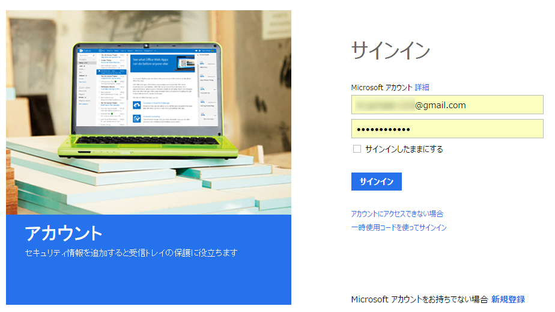

左サイドバーにある `受信トレイを表示する`をクリック

右上の設定から `オプション`をクリック

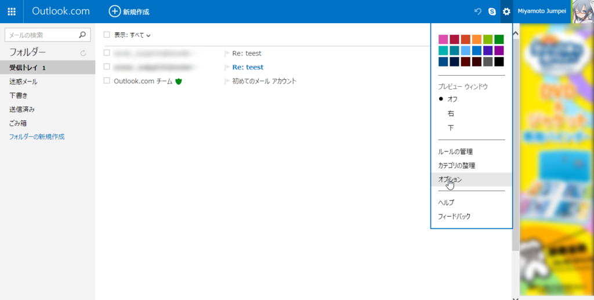

`メールアカウント`をクリック

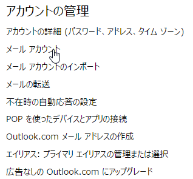

`Outlook.comメールアドレスの作成`をクリック

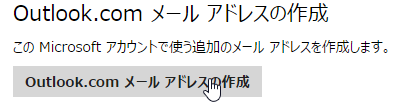

取得したいアドレスを入力して、`エイリアスを作成`をクリック

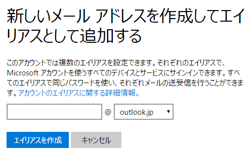

これで、outlook.jpアドレスを取得することができました。

# Outlookメールアプリで設定する

Outlookメールアプリを開いたら、右下のメニューから設定をタップ

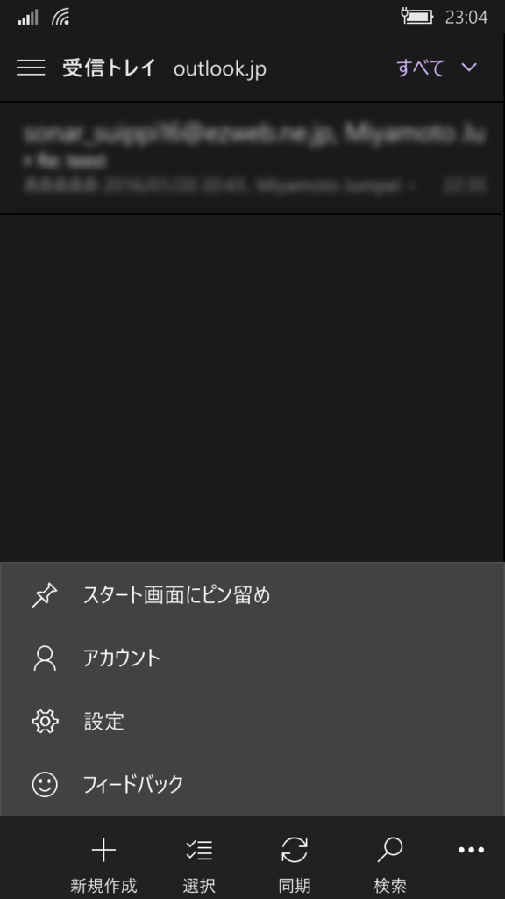

「アカウント」をタップ

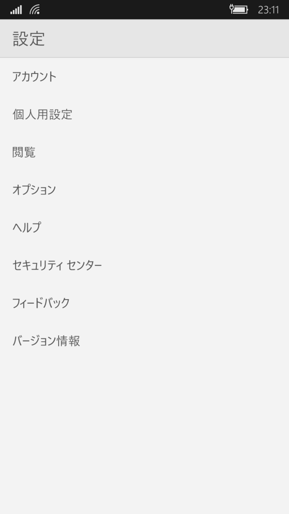

「アカウントの追加」をタップ

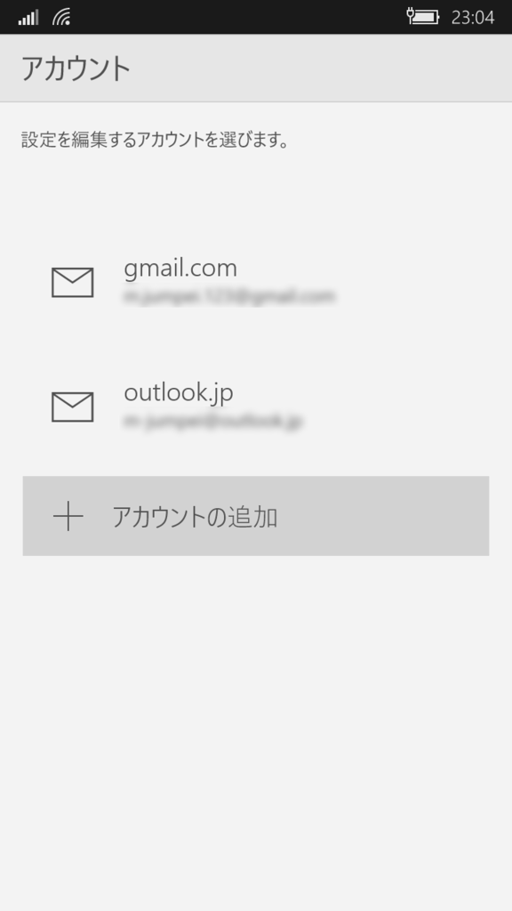

ここで「Exchange」を選択。**Outlook.comではありません**

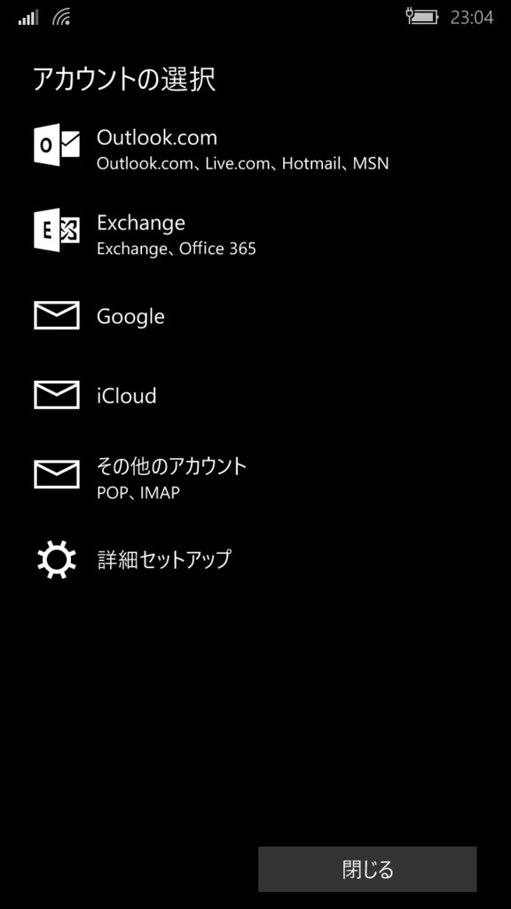

先ほど取得した「outlook.jp」のメールアドレスを入力し、その後パスワードを入力して認証させます。

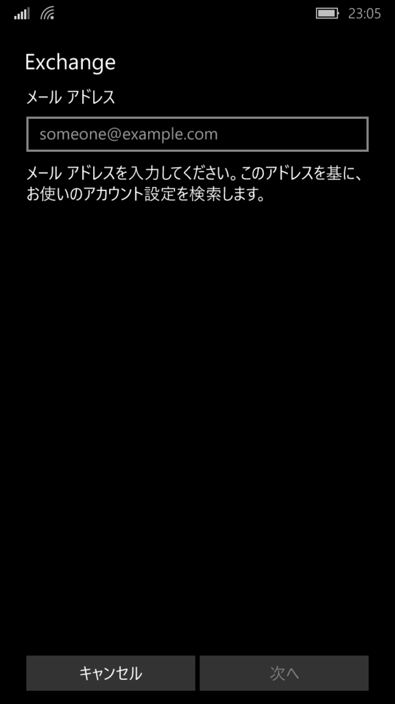

認証が完了されると、完了画面になります。

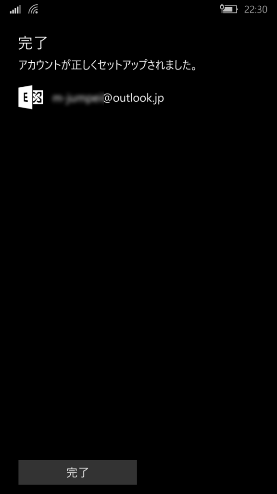

以上で設定は完了です。

設定の「オプション」の「通知」をONにしておくと、普段のキャリアメールのように、リアルタイムでメールを受信して通知してくれます。

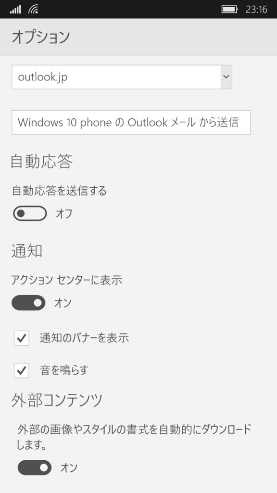

メールを受信すると、通知が出るようになります。

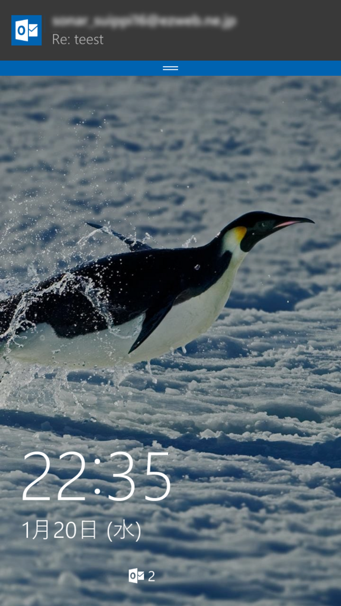
