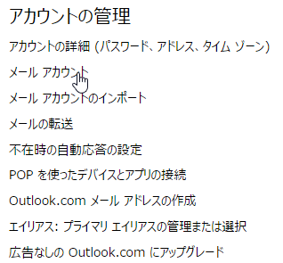

はてなブログからの移行記事

私のMicrosoftアカウントは元々Gmailで登録したのですが、  
Windows 10 Mobile(以下Win10M)メインで使うメールアドレスが欲しかったので、  
outlook.jpアドレスを取得してW10Mの「Outlookメール」アプリで使う方法を紹介します。

### 環境

* Office 365 Solo

 

# outlook.jpアドレスを取得する

* Microsoftアカウントにサインインします

[https://login.live.com/login.srf](https://login.live.com/login.srf)

 

* 左の「受信トレイを表示する」をクリック

 

* 右上の設定から「オプション」をクリック

 

* 「メールアカウント」をクリック

 

* 「Outlook.comメールアドレスの作成」をクリック

 

* 取得したいアドレスを入力して、「エイリアスを作成」をクリック

 

これで、outlook.jpアドレスを取得することができました。

 

 

# 「Outlookメール」アプリで設定する

* Outlookメールを開いたら、右下のメニューから設定をタップ

 

* 「アカウント」をタップ

 

* 「アカウントの追加」をタップ

 

* ここで「Exchange」を選択。**Outlook.comではありません**

 

* 先ほど取得した「outlook.jp」のメールアドレスを入力し、その後パスワードを入力して認証させます。

 

* 認証が完了されると、完了画面になります。

  

以上で設定は完了です。

設定の「オプション」の「通知」をONにしておくと、普段のキャリアメールのように、リアルタイムでメールを受信して通知してくれます。

 

メールを受信すると、通知が出るようになります。

おわり

 
