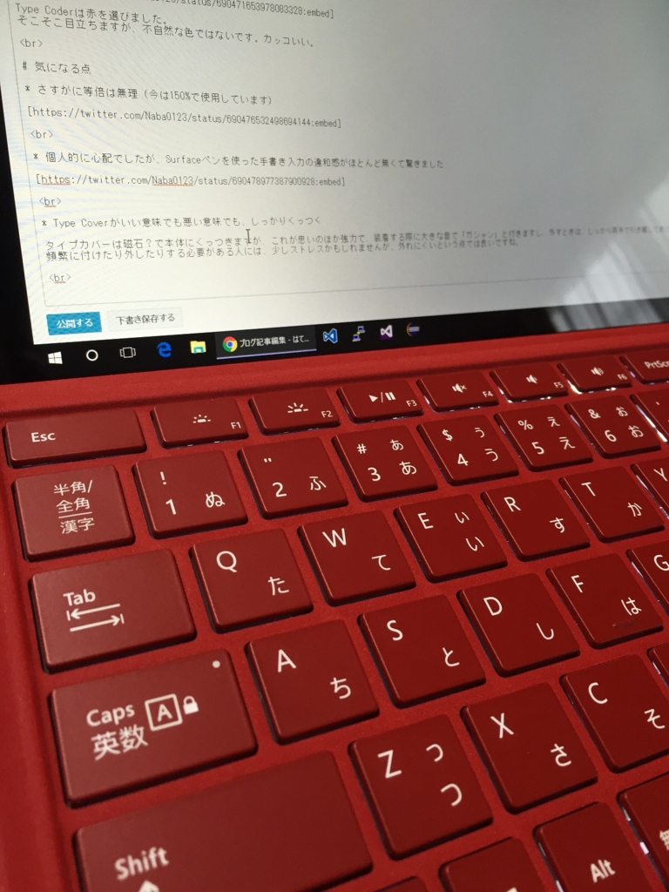

はてなブログからの移行記事

Surface Bookにしようか、Surface Pro 4にしようか散々悩みましたが、私はPro 4を選びました。

Microsoft Storeで予約したかったのですが、すでに予約分は完売しており、公式小売店？のヨドバシカメラで予約をしました。

で、「まとめて発送」にしたと思ったのですが、先にキーボードだけ届きました。どないしろと。

<blockquote class="twitter-tweet">
フライングされた <a href="https://t.co/hsjQJt7PLQ">pic.twitter.com/hsjQJt7PLQ</a>
&mdash; Naba (ナーバ) (@Naba0123) <a href="https://twitter.com/Naba0123/status/688236596739493889?ref_src=twsrc%5Etfw">January 16, 2016</a></blockquote> 

開封して打鍵感を楽しんだ後、昨日ついに本体が届きました。

石川県なのに、発売日の朝にヤマトさんが届けてくれました！本当にありがとう！  
（おかげで会社に遅刻しそうになった）

<blockquote class="twitter-tweet">
会社行かなくちゃいけないけど、きたあああ <a href="https://t.co/flPR4kdjNL">pic.twitter.com/flPR4kdjNL</a>
&mdash; Naba (ナーバ) (@Naba0123) <a href="https://twitter.com/Naba0123/status/690317346661990400?ref_src=twsrc%5Etfw">January 21, 2016</a></blockquote> 

# 開封

<blockquote class="twitter-tweet">
リコール対象外だよ <a href="https://t.co/o7WEWBRyIn">pic.twitter.com/o7WEWBRyIn</a>
&mdash; Naba (ナーバ) (@Naba0123) <a href="https://twitter.com/Naba0123/status/690469807720939520?ref_src=twsrc%5Etfw">January 22, 2016</a></blockquote> 

Surface Pro ～ Surface Pro 3までの電源コードに問題が見つかったようで、リコール対象となっています。

[https://www.microsoft.com/surface/ja-jp/support/warranty-service-and-recovery/powercord](https://www.microsoft.com/surface/ja-jp/support/warranty-service-and-recovery/powercord)

<blockquote class="twitter-tweet">
<a href="https://t.co/YCsMUD5aDk">pic.twitter.com/YCsMUD5aDk</a>
&mdash; Naba (ナーバ) (@Naba0123) <a href="https://twitter.com/Naba0123/status/690471653978083328?ref_src=twsrc%5Etfw">January 22, 2016</a></blockquote> 

Type Coderは赤を選びました。  
そこそこ目立ちますが、不自然な色ではないです。カッコいい。

# 気になる点

* さすがに等倍は無理（今は150%で使用しています）

<blockquote class="twitter-tweet">
等倍はさすがに無理かw <a href="https://t.co/LPRePun9Fk">pic.twitter.com/LPRePun9Fk</a>
&mdash; Naba (ナーバ) (@Naba0123) <a href="https://twitter.com/Naba0123/status/690476532498694144?ref_src=twsrc%5Etfw">January 22, 2016</a></blockquote> 

* 個人的に心配でしたが、Surfaceペンを使った手書き入力の違和感がほとんど無くて驚きました

<blockquote class="twitter-tweet">
この画面との隙間の無さ最高だ <a href="https://t.co/3TPddiQa8o">pic.twitter.com/3TPddiQa8o</a>
&mdash; Naba (ナーバ) (@Naba0123) <a href="https://twitter.com/Naba0123/status/690478977387900928?ref_src=twsrc%5Etfw">January 22, 2016</a></blockquote> 

* Type Coverがいい意味でも悪い意味でも、しっかりくっつく

タイプカバーは磁石？で本体にくっつきますが、これが思いのほか強力で、装着する際に大きな音で「ガシャン」と付きますし、外すときは、しっかり両手で引き離してあげる必要があります。  
頻繁に付けたり外したりする必要がある人には、少しストレスかもしれませんが、外れにくいという点では良いですね。

* Type Coverを傾けた状態だと、タスクバーにタッチがしづらい

そこまで気にはなりませんが、Type Coverを本体側にくっ付けて、傾けた状態にすると、タスクバーのアイコンが少しタッチしづらいかもしれないです。  
Surfaceペンを使用すればそうでもないと思います。

 

とまぁ、総評は「最高」です。みんなで買いましょう。
