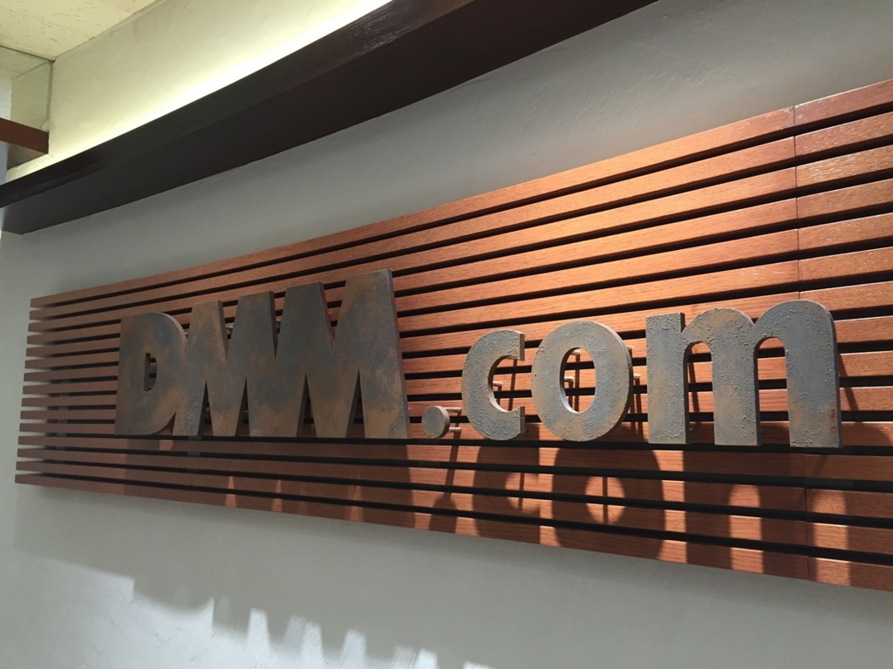

はてなブログからの移行記事

プログラミング生放送 第39回勉強会@DMM.comラボ 恵比寿 に参加しました。

[http://pronama.azurewebsites.net/2016/01/26/pronama-39-at-dmm-com/](http://pronama.azurewebsites.net/2016/01/26/pronama-39-at-dmm-com/)

# 行き

金曜日の夜に金沢から夜行バスで東京に向かいました。

<blockquote class="twitter-tweet">
思ったよりも辛いぞJRバス <a href="https://t.co/F3c2VIk54C">pic.twitter.com/F3c2VIk54C</a>
&mdash; Naba (ナーバ) (@Naba0123) <a href="https://twitter.com/Naba0123/status/698145709875310592?ref_src=twsrc%5Etfw">February 12, 2016</a></blockquote> 

想像以上に狭かった。でも頑張った。

# 設営

夜行バスの寝不足をモンスターでどうにかして、会場設営を手伝うために11時に会場入りしました。

<blockquote class="twitter-tweet">
お待ちしてます！ <a href="https://twitter.com/hashtag/pronama?src=hash&amp;ref_src=twsrc%5Etfw">#pronama</a> <a href="https://t.co/bA66QEal5J">pic.twitter.com/bA66QEal5J</a>
&mdash; Naba (ナーバ) (@Naba0123) <a href="https://twitter.com/Naba0123/status/698330781920292864?ref_src=twsrc%5Etfw">February 13, 2016</a></blockquote> 

新作マグネットも用意されていました。  
意外と単価は安いそうです。

<blockquote class="twitter-tweet">
新作マグネットありますよ <a href="https://twitter.com/hashtag/pronama?src=hash&amp;ref_src=twsrc%5Etfw">#pronama</a> <a href="https://t.co/U6l3jVyQV4">pic.twitter.com/U6l3jVyQV4</a>
&mdash; Naba (ナーバ) (@Naba0123) <a href="https://twitter.com/Naba0123/status/698331575570690048?ref_src=twsrc%5Etfw">February 13, 2016</a></blockquote> 

<blockquote class="twitter-tweet">
受付で待ってます〜！ <a href="https://twitter.com/hashtag/pronama?src=hash&amp;ref_src=twsrc%5Etfw">#pronama</a> <a href="https://t.co/tGSnYOsmmP">pic.twitter.com/tGSnYOsmmP</a>
&mdash; Naba (ナーバ) (@Naba0123) <a href="https://twitter.com/Naba0123/status/698338413922025472?ref_src=twsrc%5Etfw">February 13, 2016</a></blockquote> 

# 勉強会

登壇されたのはマスコットアプリ文化祭の受賞者各位ということもあり、内容が濃く勉強になりました。

アプリ内で工夫された点、苦労した点、オススメのライブラリなど、知らない内容ばかりでした。

受賞されたみなさん、おめでとうございます。

<blockquote class="twitter-tweet">
カッコいいSurfaceの人 <a href="https://twitter.com/hashtag/pronama?src=hash&amp;ref_src=twsrc%5Etfw">#pronama</a> <a href="https://t.co/lYyHl4xNIL">pic.twitter.com/lYyHl4xNIL</a>
&mdash; Naba (ナーバ) (@Naba0123) <a href="https://twitter.com/Naba0123/status/698368175000281088?ref_src=twsrc%5Etfw">February 13, 2016</a></blockquote> 

キーボードが好きで仕方がない[彼](https://twitter.com/pmw1415)は、Myキーボードを持参していました。流石ですね。

あとLTしました。

<iframe src="//www.slideshare.net/slideshow/embed_code/key/kOBeNo9KwxI29O" width="595" height="485" frameborder="0" marginwidth="0" marginheight="0" scrolling="no" style="border:1px solid #CCC; border-width:1px; margin-bottom:5px; max-width: 100%;" allowfullscreen> </iframe> 
 <strong> <a href="//www.slideshare.net/naba0123/twitter-58218772" title="Twitter拡散力の話" target="_blank">Twitter拡散力の話</a> </strong> from <strong><a href="https://www.slideshare.net/naba0123" target="_blank">naba0123</a></strong> 

# 懇親会

いつものさくら水産です。もう唐揚げは人数分頼みません。 

[http://jz5.jp/2015/05/17/karaage-lemon/](http://jz5.jp/2015/05/17/karaage-lemon/)

# 帰り

<blockquote class="twitter-tweet">
金沢へ向けて出発 <a href="https://t.co/z4O0jtaT7j">pic.twitter.com/z4O0jtaT7j</a>
&mdash; Naba (ナーバ) (@Naba0123) <a href="https://twitter.com/Naba0123/status/698516803849334786?ref_src=twsrc%5Etfw">February 13, 2016</a></blockquote> 

行きと同じJRバスです。  
行きと違ってクタクタだったので、寝て起きてを繰り返していたら、あっという間に金沢に帰ってきました。

# 告知

<del>流れで</del> **プロ生@金沢** を開催する運びとなりまして、会場や登壇などの管理を任されたので、頑張ります。

<blockquote class="twitter-tweet">
プロ生@金沢、決定しました。詳細は後日通知します <a href="https://twitter.com/hashtag/pronama?src=hash&amp;ref_src=twsrc%5Etfw">#pronama</a>
&mdash; Naba (ナーバ) (@Naba0123) <a href="https://twitter.com/Naba0123/status/698509248813117440?ref_src=twsrc%5Etfw">February 13, 2016</a></blockquote> 

