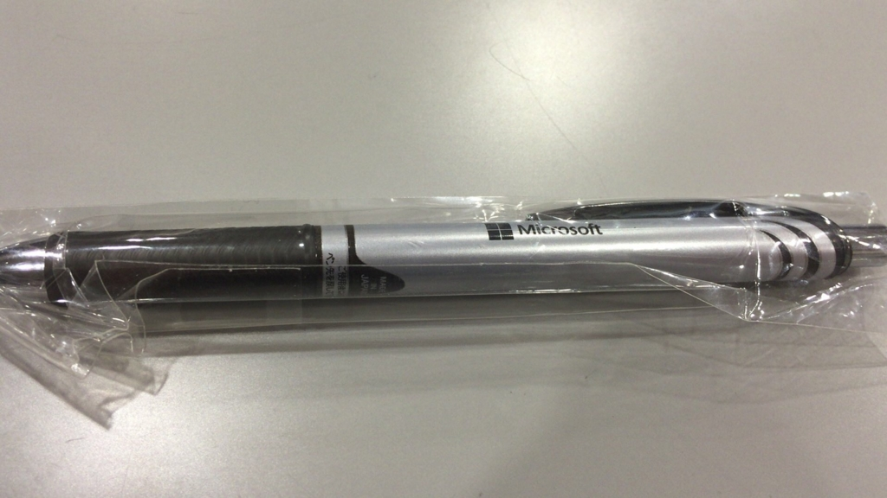
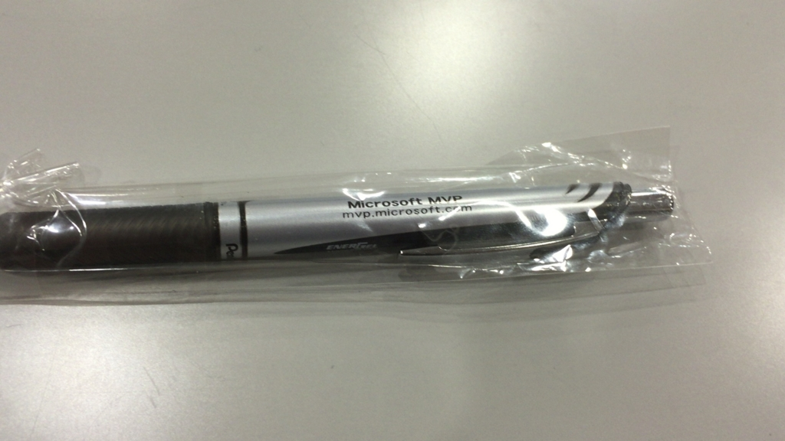

はてなブログからの移行記事

以前調べた時は、connpassの一般申込みが満員で、諦めていたのですが、昨日キャンセルで空いてることを教えて頂き、参加することが出来ました。

[http://hokurikucomcamp.connpass.com/event/23628/](http://hokurikucomcamp.connpass.com/event/23628/)

登壇されている方は、ほとんどがMicrosoft MVPの方ばかり。  
そんな方の登壇を、無料で、しかも金沢で聞くことが出来るなんて、行かないわけにはいきませんね。

 

午前中は用事があり、午後からの参加でした（午前中のC#の話を聞くことが出来なかったのが残念で仕方がない…）。

## 「Windows 10 楽しい使い方」
**さくしま たかえ 氏 (MVP for Windows Experience)**

Cortanaについて、面白く、でも知らなかったようなことを説明をされていました。

日本版だけ敬称（～さん）をちゃんと認識するようになっていたり、Cortana起動時にお辞儀をするのは日本版だけ、等普段気付きはしないような豆知識から、Cortanaの便利機能、セットアップの方法などを知ることが出来ました。

[http://www.amazon.co.jp/dp/4798142883/](http://www.amazon.co.jp/dp/4798142883/)

 

## 「DataTableを徹底解剖しようぜ!」
**片桐 継 氏**

とてもセキュリティに厳しい（USBポート物理閉鎖、Visual Studioのアップデート審査に1年）会社にお勤めのようです。

メモリ上に作るRDBのようなDataTableが、いかに便利か、こんなことが出来るよー、等を説明されていました。

進め方がとても面白かったです。笑いアリでした。

ブログのタイトルが長いことで有名だそうです。

[http://blogs.wankuma.com/esten/default.aspx](http://blogs.wankuma.com/esten/default.aspx)

 

## 「エンジニアよ興味を持ち続けろ！ドローンだってITだ」
**西脇 資哲 氏 (日本マイクロソフト株式会社業務執行役員・エバンジェリスト)**

プレゼンのオーラが違いました。引きこまれました。

2015年の日本はドローン業界にとって最悪の幕開けとなったようですが、それでもドローンは楽しいし、何より生活が便利になるものです。  
災害救助や建設現場などでもドローンが当たり前のように使われるような日々が来ることを祈っています。

西脇さんの講演の中で何度も取り上げられた言葉は、**「エンジニアはもっともっと好奇心を持って夢中になってこだわって突き抜けて欲しい」**でした。  
西脇さんは業務の傍らドローンに興味を持ち、どんどん購入して学んでレビューを続けた結果、ついに開発社から直々にレビューが来るようになり、今では雑誌を手掛けているそうです。

誰よりも詳しくなることで、その道のプロフェッショナルになれる。  
当たり前の事ですが、そんな当たり前のことに気付かされた、素晴らしい講演でした。

https://www.facebook.com/mnishiwa

 

## 「いまから始める Windows Server」 
**澤田 賢也 氏 (Microsoft MVP for Cloud and Datacenter Management)**

Windows Serverは今まで触ったことがなく、実際にリモートデスクトップで稼働中のWindows Serverに接続をされて説明をしてくださったので、分かりやすく学ぶことが出来ました。

Windows Serverはグループポリシーという機能が便利だそうです。

また、Windows Server 2016からは、制御下のクライアントPCのCortanaの制御もまとめて行えるそうです。すげぇ。

https://www.facebook.com/masaya.sawada.5

 

## 「馴染みの .NET Framework で CMS を使ってみよう

**矢後 比呂加 氏 (Microsoft MVP for Visual Studio and Development Technologies)**

C#をあまり真面目に使ったことがないのであやふやでしたが、 .NET Framework と ASP.NETの関係から一から説明してくださったので、すんなり理解することが出来ました。

メインは Umbraco についてのセッションで、デモも多く分かりやすかったです。  
ASP.NETは知識が皆無なので、いつか学んでみたいですね。

[http://miso-soup3.hateblo.jp/](http://miso-soup3.hateblo.jp/)

[https://umbraco.com/](https://umbraco.com/)

## LT

* リモートデスクトップ関連 - 金子 雄一 氏  
Android/iOSからWindowsへリモートデスクトップが出来るアプリを公開しています。デモでFFをやっていました。

* 「var禁止」禁止 - むろほしりょうた 氏  
C#の「var禁止」は悪ですよというお話。テンポが非常に良かったです。

* AzureAutomatioを使ってみた話 - 山P 氏  
Azureのインスタンスを作りすぎるとお金がピンチになるので、AzureAutomatioとPowerShellを使って制御をしましょう、というお話。

 

## じゃんけん大会

書籍などが当たるじゃんけん大会。見事に惨敗しました。

参加賞（というわけでもありませんが）のボールペンです。  
Microsoftと「MVP」の文字が入っているのがカッコいい。

 

今回は突然の参加で懇親会等には行けませんでしたが、次回（来年？）は色々な人とお話をしてみたいと思います。

技術的な勉強にも、プレゼンの勉強にもなりました。

ありがとうございました。

 
