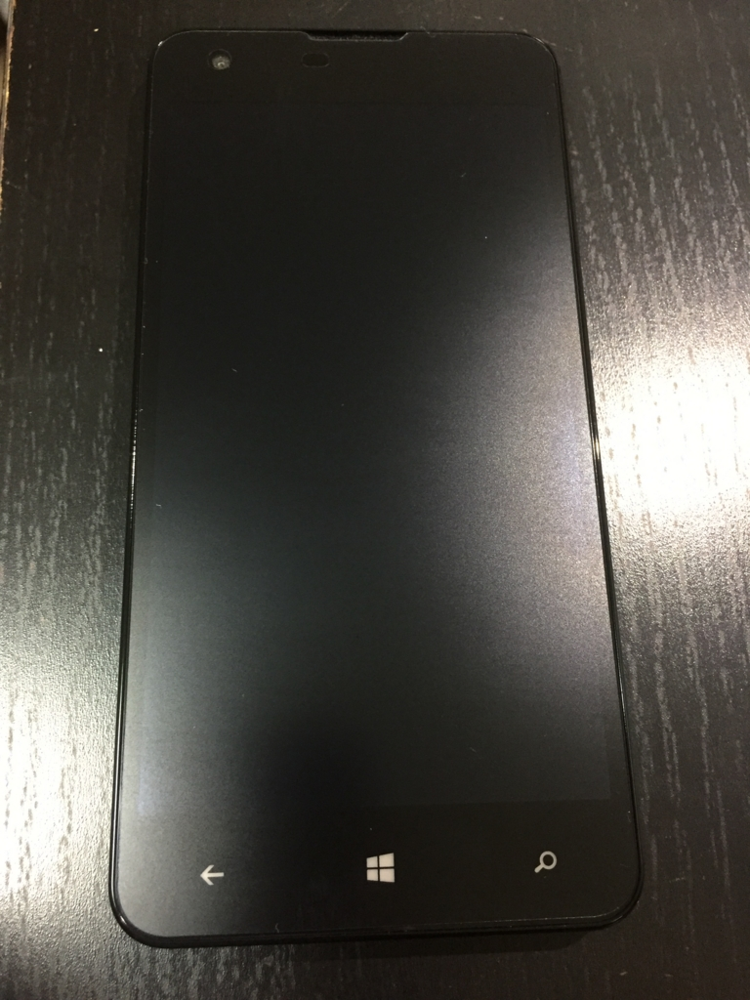

はてなブログからの移行記事

MADOSMA Q501には最初から保護シートが貼ってあります。

が、反射がひどかったり指の滑りが悪かったりと、少し気になってたので、アンチグレアの保護シートに貼り替えました。

<blockquote class="twitter-tweet">
MADOSMAのアンチグレアシート届いた <a href="https://t.co/lRgcEKW03K">pic.twitter.com/lRgcEKW03K</a>
&mdash; Naba (ナーバ) (@Naba0123) <a href="https://twitter.com/Naba0123/status/702795056843923456?ref_src=twsrc%5Etfw">February 25, 2016</a></blockquote> 

張り替えたのは、OverLay Plus for MADOSMAです。

[http://www.amazon.co.jp/OverLay-MADOSMA-%E3%82%A2%E3%83%B3%E3%83%81%E3%82%B0%E3%83%AC%E3%82%A2-OLQ501-12/dp/B0107J6RVY](http://www.amazon.co.jp/OverLay-MADOSMA-%E3%82%A2%E3%83%B3%E3%83%81%E3%82%B0%E3%83%AC%E3%82%A2-OLQ501-12/dp/B0107J6RVY)

 

最初から貼ってあった保護シートは、拭いても指紋がすぐについてしまっていました。

保護シートを剥がすと、何やら拭いた後が見えてきましたが、綺麗にアルコールで拭きなおして、新しい保護シートに貼り替え。

反射が減って良い感じです。

アンチグレアの、少しざらついた感じが結構好きです。

個人的には、もう少し滑りが良くてもよかったかもしれませんが、概ね満足です。

 
