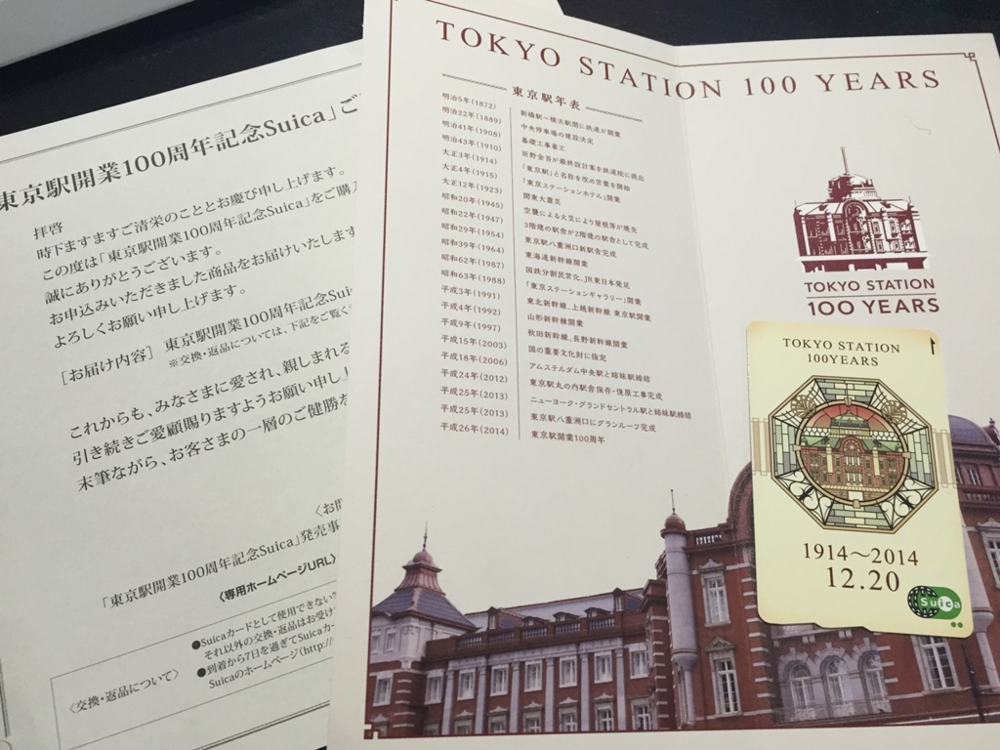
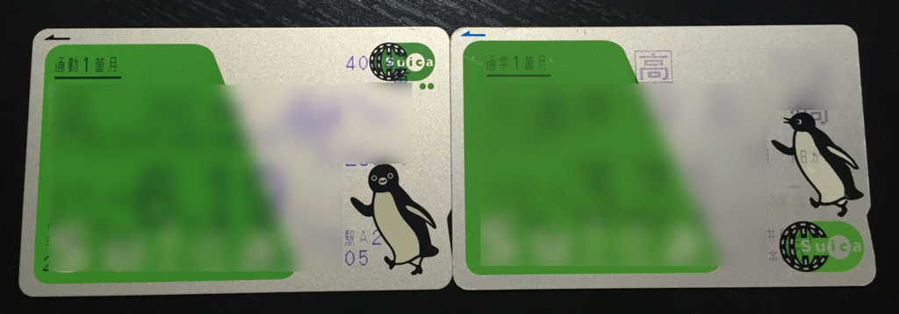

はてなブログからの移行記事

（多分）去年の1月に大変人気となっていた 東京駅100周年Suica が、先月ようやく届きました。

<blockquote class="twitter-tweet">
そういえば、1年ぐらいかかってようやく東京駅100周年Suicaの入金した
&mdash; Naba (ナーバ) (@Naba0123) <a href="https://twitter.com/Naba0123/status/684377854876889088?ref_src=twsrc%5Etfw">January 5, 2016</a></blockquote> 

<blockquote class="twitter-tweet">
東京駅Suicaようやく入手した <a href="https://t.co/eLoF2LQqRk">pic.twitter.com/eLoF2LQqRk</a>
&mdash; Naba (ナーバ) (@Naba0123) <a href="https://twitter.com/Naba0123/status/703482491617718272?ref_src=twsrc%5Etfw">February 27, 2016</a></blockquote> 

100周年自体は、2014年なんですね。

つまり、今年は開業102年目…？

 

余談ですが、現在の通常Suicaのペンギンは、正面を向いていますが、その前のデザインではペンギンが横を向いています。

左が現在(2015年5月購入)のSuica、右が2007年4月に購入したSuicaです。

Suicaのロゴの位置も変わっているんですね。

 
