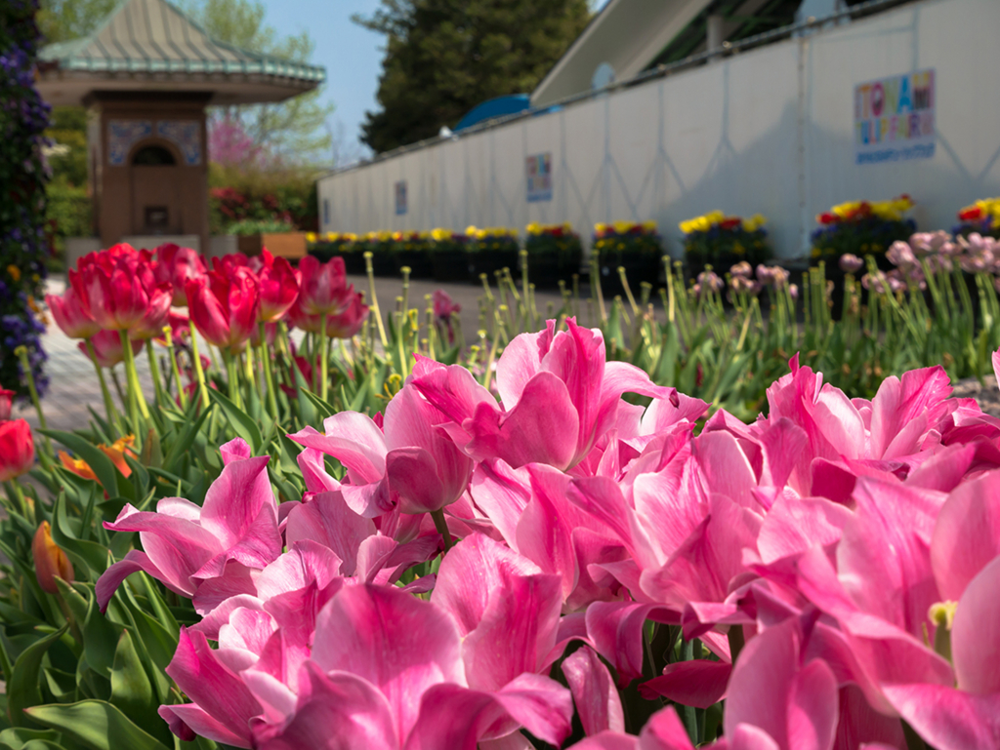
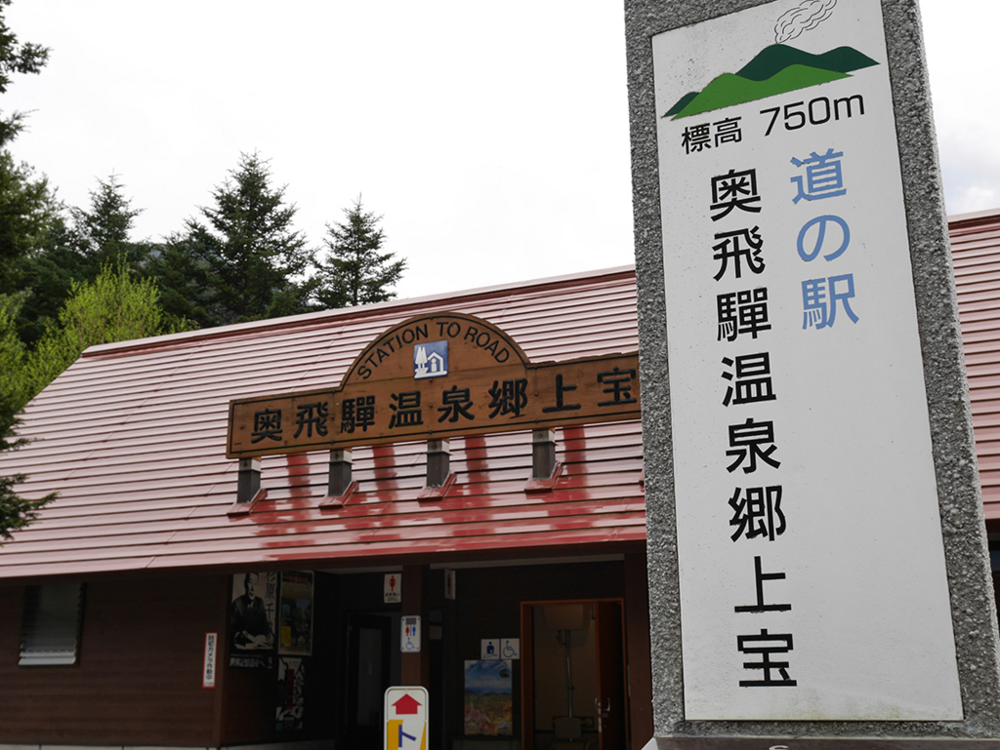
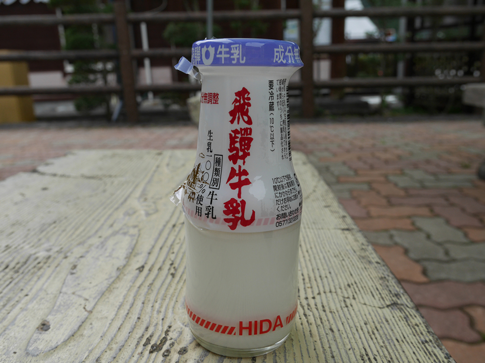
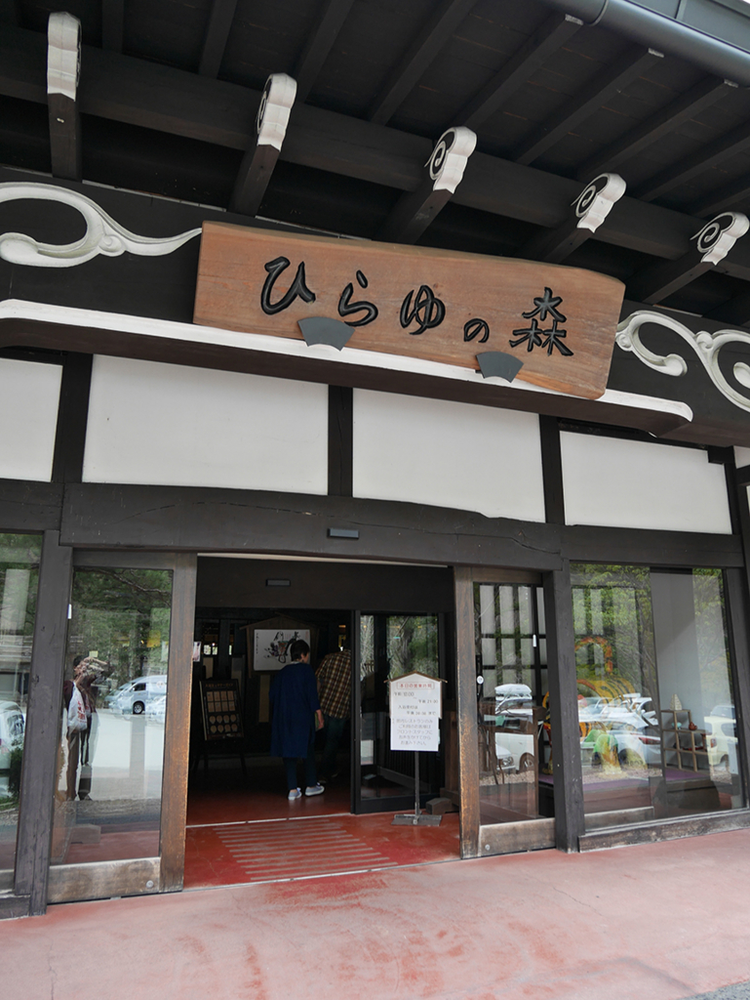
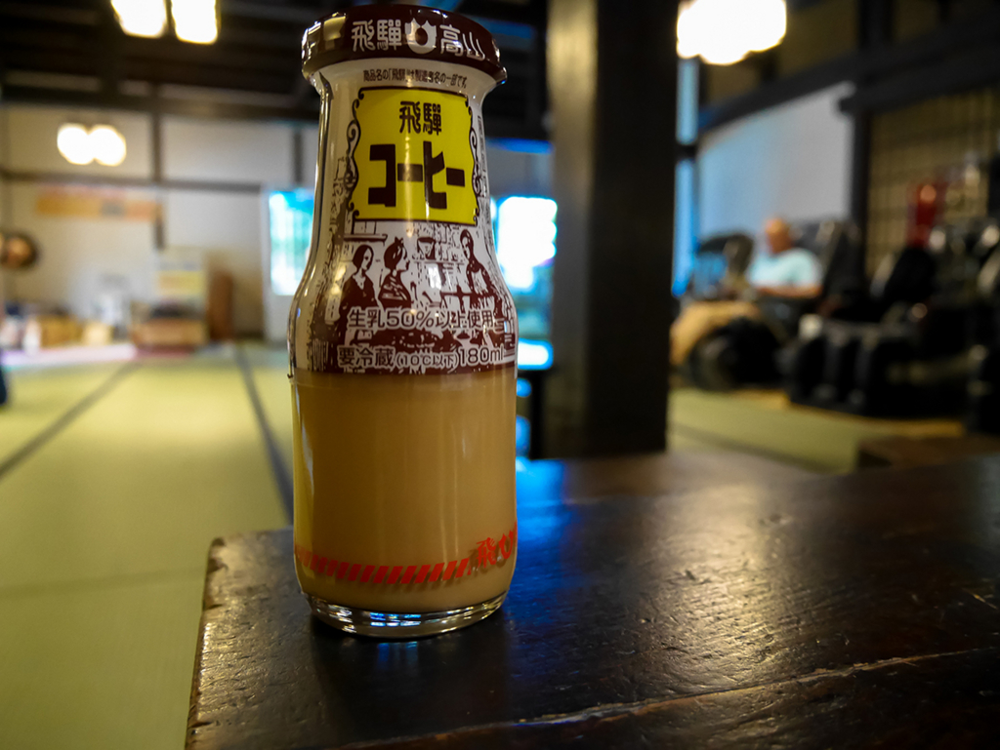
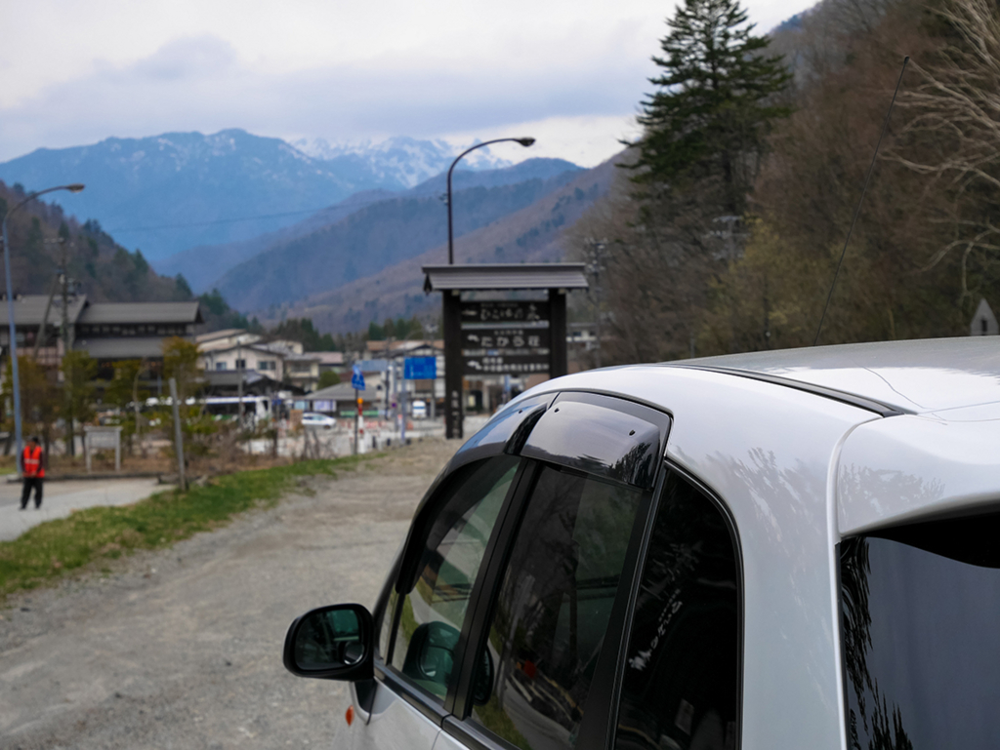
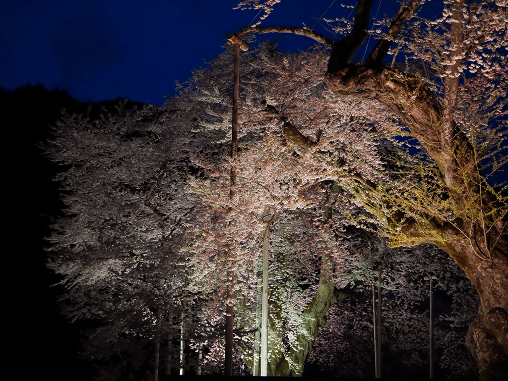
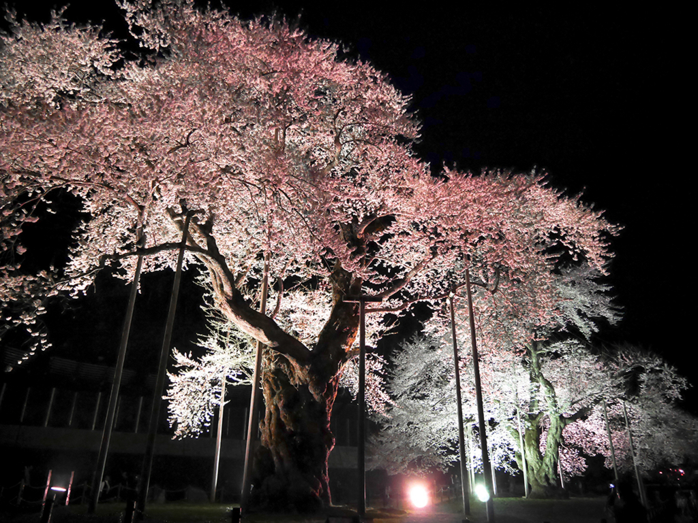

はてなブログからの移行記事

今日は 金沢→砺波→奥飛騨→荘川 を走りました。350kmぐらいです。

# となみチューリップフェア

[http://www.info-toyama.com/event/40007/](http://www.info-toyama.com/event/40007/)

看板を見つけてフラフラと。

駐車料金500円払って入り口に行くと入場料1000円の文字。

入り口のチューリップを撮って、さっと帰っていくのであった。

## 道の駅 奥飛騨温泉郷 上宝

牛乳美味しいです。  
（ラベルを剥がし始めてから、写真を撮ることを思い出した）

## ひらゆの森

[http://www.hirayunomori.co.jp/](http://www.hirayunomori.co.jp/)

露天風呂5種、日帰り入浴500円、安い。

ここではコーヒー牛乳を飲みました。

まだ山の方では雪が残っているようです。

## 荘川桜

帰り途中にラジオを聴いていたら、荘川桜が８分咲きと言っていたので。

[http://www.shokawa.net/introduction/452](http://www.shokawa.net/introduction/452)

上手く写真が撮れるようになりたいですね…！

先日、ついにカメラを買いました。Panasonic の DMC-GF7W という機種です。

<blockquote class="twitter-tweet">
純正シャレオツカメラケース <a href="https://t.co/b8vMCmuL9l">pic.twitter.com/b8vMCmuL9l</a>
&mdash; Naba (ナーバ) (@Naba0123) <a href="https://twitter.com/Naba0123/status/723674487372156928?ref_src=twsrc%5Etfw">April 23, 2016</a></blockquote> 

早く使いこなしたい。
