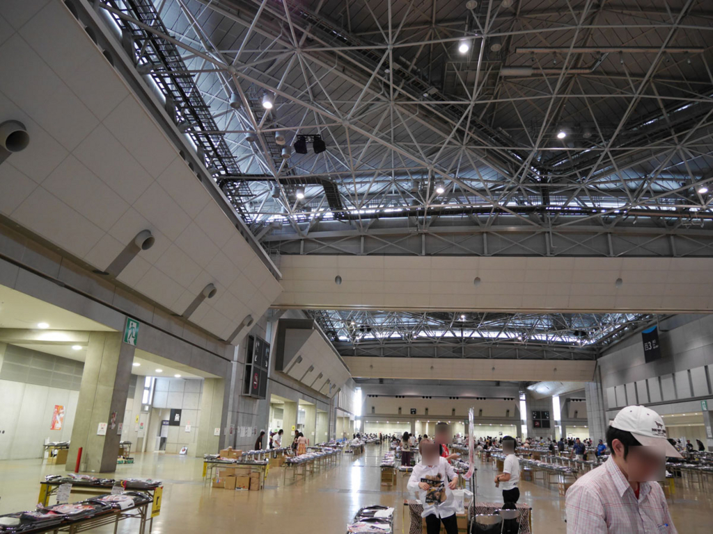
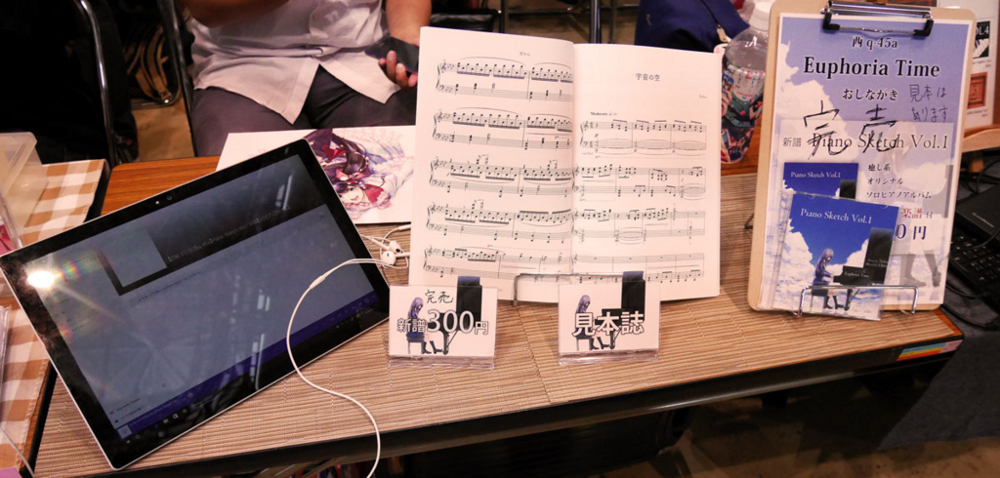

はてなブログからの移行記事

前編は以下から。

[初めてコミケにサークル参加をした話（準備編）](./0817-c90)

ついに迎えた当日。初めてサークル参加をして感じたこと、学んだことを書いていきます。

 

## 入場

当日は都内に住む友人の家から向かい、国際展示場駅には7時30分過ぎに到着しました。

サークル入場は7時30分～9時（実質8時45分）なので、かなり早めに。

早々に受付を済ませて自分のブースへ向かうのですが、なんと人の少ないこと。  
普段は人で溢れかえっている時にしか東京ビックサイトには行ったことがないので、この時間のコミケ会場は新鮮でした。

自分のブースを確認して、とりあえず準備を始めます。

<blockquote class="twitter-tweet">
ブース着きました！ <a href="https://t.co/HvMXHPKjAp">pic.twitter.com/HvMXHPKjAp</a>
&mdash; Naba (ナーバ) (@Naba0123) <a href="https://twitter.com/Naba0123/status/764593729265033216?ref_src=twsrc%5Etfw">August 13, 2016</a></blockquote> 

ディスプレイのはいろいろ考えていたのですが、シンプルに、

* おしながき
* 見本紙
* 商品
* 試聴機（急遽自分のSurfaceを使用）

となりました。

<blockquote class="twitter-tweet">
<a href="https://t.co/iZWl4XxtwI">pic.twitter.com/iZWl4XxtwI</a>
&mdash; Naba (ナーバ) (@Naba0123) <a href="https://twitter.com/Naba0123/status/764602448010895364?ref_src=twsrc%5Etfw">August 13, 2016</a></blockquote> 

試聴機は用意していなかったのですが、周りのサークルが皆用意してあったので、急遽自分のSurfaceを試聴機として使用しました。

次回はAndroidかWindowsタブレットを用意して、自作アプリで試聴機を用意したいと考えています（希望）。

 

## 開場、頒布

10時に開場。無名サークル故に、17部用意してきっと余るだろうなーと思っていたのですが、なんと **開場1時間で完売** 。

<blockquote class="twitter-tweet">
完売しました！数が少なくて本当にごめんなさい！
&mdash; Naba (ナーバ) (@Naba0123) <a href="https://twitter.com/Naba0123/status/764644302794272768?ref_src=twsrc%5Etfw">August 14, 2016</a></blockquote> 

これには自分もビックリ、その後に買いに来てくれた方もビックリ。

本当に申し訳ないです…自主制作ということで今回は楽譜付きで300円という破格でしたが、冬コミで再頒布する今回の「Piano Sketch Vol.1」はCDと楽譜を業者に発注する予定のため、多少値段が高くなってしまうかもしれませんがご了承下さい。

 

その後は、お世話になった方へ挨拶へ行ったり、逆に知り合いが遊びに来たりといろいろしていたら午後4時を迎えて閉会となりました。

完売した後に、買いに来てくれた方は10人程でした。  
30部ぐらいが今回は調度良かったようです。  
非常に申し訳ない。

 

## 反省点、告知

以上、初サークル参加の話でした。  
ひとまず、高評価を頂けたようで何よりです。

時間があったので同じジャンルのサークルをうろうろしていたのですが、ＣＤ＋楽譜で売っているサークルはとても少なかった印象です。  
その中でも、オリジナル曲＋ＣＤは今回の夏コミでは私のサークルのみだったと思います（自分調べ）。  

 

さて、冬コミですが、**申し込んでいます！**

ですが、今回のボリューム並の新譜は出せそうにない（仕事が忙しい…）ので、出せてもミニアルバム（CDのみ）となりそうです。。

 

次回への抱負。

* 試聴機・試聴用アプリ制作
* 机に敷く布の用意

以上、これからもよろしくお願いします。

 
 
