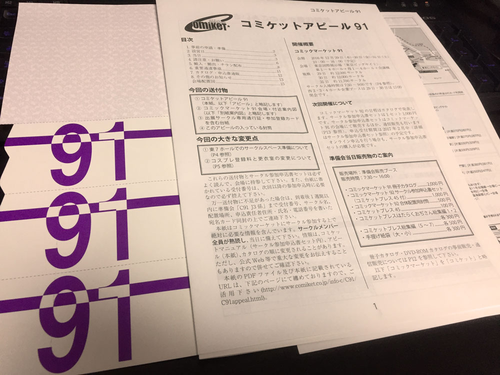
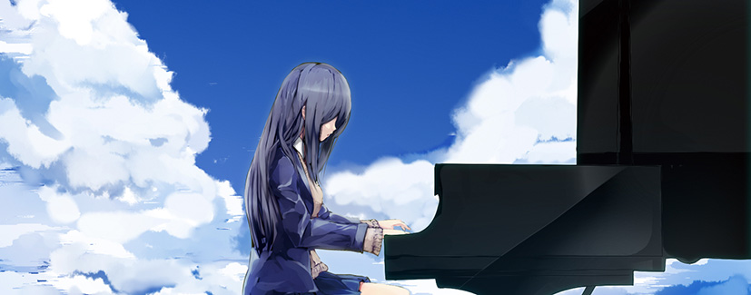

はてなブログからの移行記事

2016年冬コミ C91 に当選しました。ありがとうございます。

配置は、**3日目 西り 34a** です。  
角？に近くていい位置かもしれません。

 

# 頒布物予定

### 夏コミ新譜の Piano Sketch Vol.1 について

夏コミにおいては、多くの方にブースへ来て頂き、あっという間に 「Piano Sketch Vol.1」 が売り切れてしまいました。  
その結果、手に届かなかった方も多く、申し訳ありませんでした。。

また手作りの楽譜であったため、楽譜なのに両開きではなく、楽譜として実用性のないものになってしまったことも反省の一つです。

 

夏コミでの反省も踏まえ、冬コミでは以下の販売形式で「Piano Sketch Vol.1」を再販します。

* **CD版**である「Piano Sketch Vol.1」と、その**楽譜版**である「Piano Sketch Score Vol.1」を**分けて頒布**をします
* 楽譜については業者へ発注をし、さらにクオリティの高いものにします（現状より価格が高くなってしまうと思います…）

詳細については、冬コミが近づいたらまた告知をさせていただきます。

 

### 冬コミの新譜について

また10曲程度の新譜を…と思っていましたが、仕事が忙しく間に合いそうにありません…すみませんorz

間に合えば、数曲が入ったミニアルバムを頒布したいと考えています。  
楽譜まで用意できれば良いのですが…。

  

冬コミも皆様に会えるのを楽しみにしております。

よろしくお願いします！

 

## 夏コミの時の記事

[初めてコミケにサークル参加をした話（準備編）](./0817-c90)

[初めてコミケにサークル参加をした話（当日編）](0828-c90)

