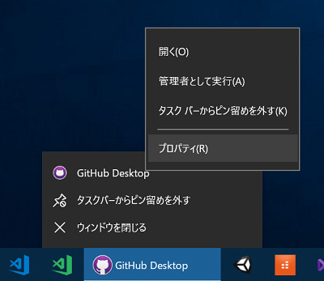
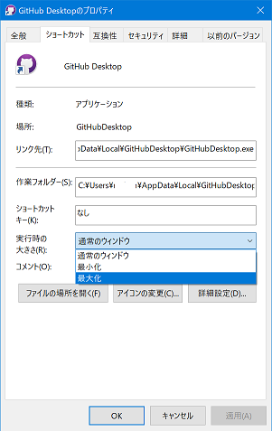

はてなブログからの移行記事

## 環境
* Surface Pro 4
* Windows 10 October 2018 Update (1809)

## 状況
* アプリケーションの起動時、アプリ自体は起動しているが、画面外で起動しているためウインドウが見えない
* ググるとよく出てくる、「タスクバーでアプリケーションをマウスホバーでプレビューし、右クリックから「移動」を選択、矢印キーで画面内に戻す」が使えない

## 解決方法

1. タスクバーでアプリケーションを右クリック
1. アプリケーション名を更に右クリック
1. プロパティを選択  

1. 「実行時の大きさ」を「最大化」にして下部の「OK」を押す  

1. 再度アプリケーションを起動し直せば、最大化されたウインドウが表示される（はず）
1. 再度同じ手順でプロパティを開き、「最大化」の部分を「通常のウィンドウ」に戻せばOK

