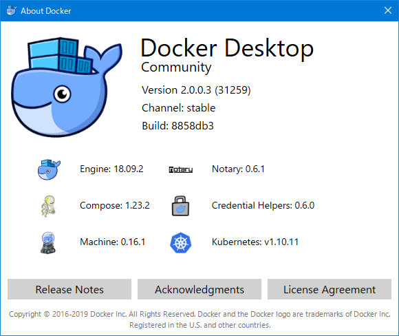
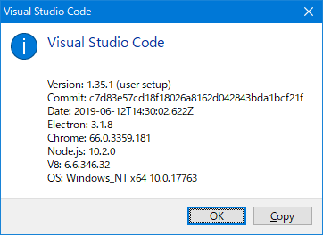
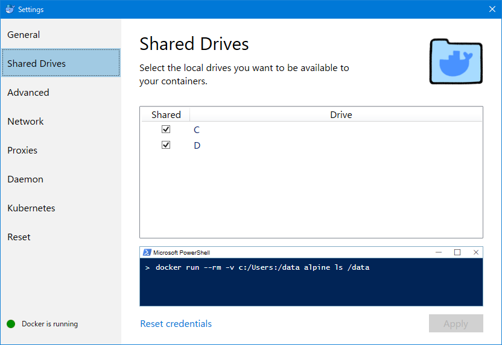
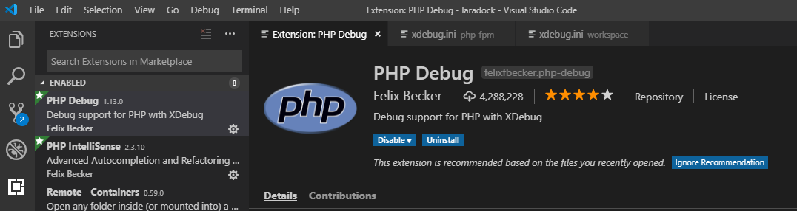
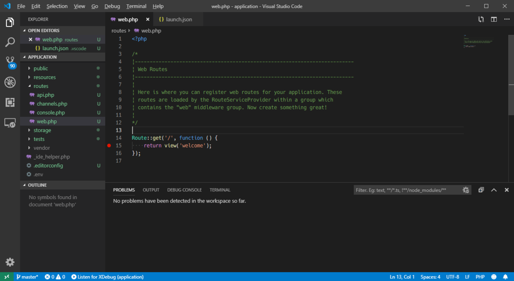
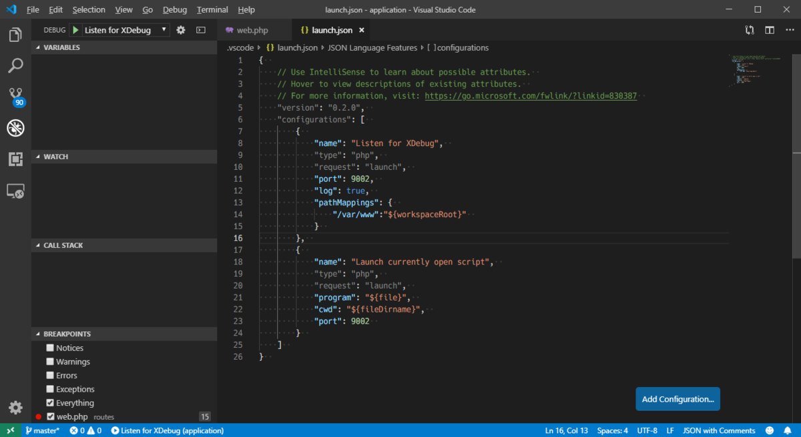
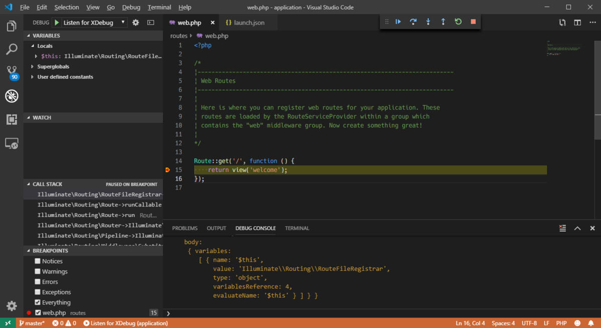

<div class="alert info">
はてなブログからの移行記事
</div>

Laravel の開発環境として、

* サーバー周り：Laradock
* エディタ：Visual Studio Code (VSCode)
* デバッグ：Xdebug (Break Point)

の環境を整えたので、そこまでの自分用構築メモです。  
認識が間違っている部分あったら申し訳ないです。

当初は VSCode Remote Development で構築しようと思いましたが、Docker のコンテナと開発手法の相性が悪そう（workspace, nginx, php-fpm でコンテナが分かれているから?）なので、通常のリモートデバッグで進めます。

<br><hr>

<hr><br>

# 環境

* Windows 10 Pro 1809 (Windows 10 October 2018 Update)
* Docker Desktop 2.0.0.3 (Hyper-V)  

* PHP 7.2.19
* Laravel 5.8.26
* Laradock (2019/06/30 時点の master)  
[https://github.com/laradock/laradock/tree/a2c7b467662706ba1af118048baeaf6e27f6a74d](https://github.com/laradock/laradock/tree/a2c7b467662706ba1af118048baeaf6e27f6a74d)
* Visual Studio Code 1.35.1  


<br>

# 1. Docker 設定

Docker の Shared Drive を On に。  
Laradock が共有前提のため、動かない。



<br>

# 2. Laradock 設定

前提として、以下のディレクトリ構成で進める。
```
workspace
 |- laradock
 |- application (Laravel Project)
```

Laradock を clone する。
```bash
$ cd workspace
$ git clone https://github.com/Laradock/laradock.git
```

Laradock でいじる設定内容は以下の通り。

* application のパス設定（.env）
* Timezome の設定（.env）
* Xdebug 有効化（.env）
* Xdebug の Remote 設定（php-fpm/xdebug.ini 及び workspace/xdebug.ini）

```

$ cp env-example .env  # .env ファイルの作成
$ vim .env  # お好きなエディタで編集
---
8行目あたり、今回のディレクトリ構成に合わせる
- APP_CODE_PATH_HOST=../
+ APP_CODE_PATH_HOST=../application
---
99行目あたり、WORKSPACE に Xdebug をインストール
- WORKSPACE_INSTALL_XDEBUG=false
+ WORKSPACE_INSTALL_XDEBUG=true
---
143行目あたり、WORKSPACE_TIMEZONE に Asia/Tokyo を設定
- WORKSPACE_TIMEZONE=UTC
+ WORKSPACE_TIMEZONE=Asia/Tokyo
---
158行目あたり、PHP_FPM に Xdebug をインストール
- PHP_FPM_INSTALL_XDEBUG=false
+ PHP_FPM_INSTALL_XDEBUG=true

$ vim php-fpm/xdebug.ini # Xdebug の内容を設定
- ; xdebug.remote_host=dockerhost
- xdebug.remote_connect_back=1
- xdebug.remote_port=9000
- xdebug.remote_autostart=0
- xdebug.remote_enable=0
- xdebug.cli_color=0
+ xdebug.remote_host=host.docker.internal  # コメントを解除して、dockerホストを向くように
+ xdebug.remote_connect_back=0  # 複数の接続先に自動的につなげてくれるそうですが、今回は無効
+ xdebug.remote_port=9002  # デフォルト9000だと php-fpm のコンテナ自体のポート番号とかぶるので、Xdebug は番号をずらす
+ xdebug.remote_autostart=1  # セッションを自動で開始してくれるようにする
+ xdebug.remote_enable=1  # Xdebug のリモートデバッグを有効化
+ xdebug.cli_color=1  # CLI 上でも var_dump をカラー表示してくれたりするらしい（[https://xdebug.org/docs/display:title]）

$ cp php-fpm/xdebug.ini workspace/xdebug.ini  # php-fpm の xdebug.ini を全く同じ内容が必要なので、workspace にコピー（上書き）
```

なお、新規プロジェクトを今回のタイミングで作成したい場合は、一旦「APP_CODE_PATH_HOST」を「../」のままコンテナを作成し、  
コンテナ内でプロジェクトを作成した後に再度「../aplication」のようなプロジェクトパスに設定をしたほうが効率が良いかと思います。
（参考：[https://laradock.io/documentation/#install-laravel-from-a-docker-container:title]）

これで Laradock の設定周りは完了です。

<br>

## 補足：Laravel アプリケーション作成

今回の記事の範囲ではないため、さっくりと。

先程の workspace/application に Laravel プロジェクトを作成します。  
作成は、環境が整っているコンテナ内から行います。

Laradock を起動します。
```
$ docker-compose up -d --build nginx mysql
```
初回ビルド、恐らく10分～20分ぐらいかかるんじゃないですかね。

終わった後に、以下が出てきたら多分OK。

```
Creating laradock_docker-in-docker_1 ... done
Creating laradock_mysql_1            ... done
Creating laradock_workspace_1        ... done
Creating laradock_php-fpm_1          ... done
Creating laradock_nginx_1            ... done
```

コマンドプロンプトなりを開き、コンテナ内に入ります。
```
> docker ps
CONTAINER ID        IMAGE                COMMAND                  CREATED             STATUS              PORTS                                      NAMES
a34c5388b983        laradock_nginx       "/bin/bash /opt/star…"   About an hour ago   Up About an hour    0.0.0.0:80->80/tcp, 0.0.0.0:443->443/tcp   laradock_nginx_1
c7c75d809a64        laradock_php-fpm     "docker-php-entrypoi…"   About an hour ago   Up About an hour    9000/tcp                                   laradock_php-fpm_1
850df865449b        laradock_workspace   "/sbin/my_init"          About an hour ago   Up About an hour    0.0.0.0:2222->22/tcp                       laradock_workspace_1
9007b173d634        laradock_mysql       "docker-entrypoint.s…"   About an hour ago   Up About an hour    0.0.0.0:3306->3306/tcp, 33060/tcp          laradock_mysql_1
ff215dd5f892        docker:dind          "dockerd-entrypoint.…"   About an hour ago   Up About an hour    2375/tcp                                   laradock_docker-in-docker_1

> docker exec -it laradock_workspace_1 /bin/bash
root@850df865449b:/var/www#
```
workspace コンテナ内に入ったら、Laravel アプリケーションを作成します。
```
# composer create-project --prefer-dist laravel/laravel application
```
ちなみに、「--prefer-dist」を書くととりあえず早くなるそうです。
（参考：[https://kin29.info/composer-%E3%81%AE-prefer-dist%E3%81%A3%E3%81%A6%E3%82%88%E3%81%8F%E4%BD%BF%E3%81%86%E3%81%91%E3%81%A9%E4%BD%95%E3%81%97%E3%81%A6%E3%82%8B%EF%BC%9F/:title]）

<br>

# 3. VSCode 設定

VSCode に PHP Debug を導入します。これで Break Point を張ったりできます。



VSCodeで、Laravel Application のフォルダを開いて、とりあえず Break Point を確認したいので、「routes/web.php」を開き、「return view('welcome');」の行に Break Point 設定。



<br>

次にデバッグ設定、デバッグ画面の構成追加から、「PHP」を選び（初回のみ）、「launch.jon」が出てきたら以下のように設定をします。
```
{  
    // Use IntelliSense to learn about possible attributes.  
    // Hover to view descriptions of existing attributes.  
    // For more information, visit: https://go.microsoft.com/fwlink/?linkid=830387  
    "version": "0.2.0",  
    "configurations": [  
        {  
            "name": "Listen for XDebug",  
            "type": "php",  
            "request": "launch",  
            "port": 9002,  // 9002 合わせる
            "log": true,  
            "pathMappings": {  
                "/var/www":"${workspaceRoot}"  
            }  
        },  
        {  
            "name": "Launch currently open script",  
            "type": "php",  
            "request": "launch",  
            "program": "${file}",  
            "cwd": "${fileDirname}",  
            "port": 9002  
        }  
    ]  
}  
```



<br>

# 4. Xdebug テスト

VSCode デバッグ画面左上の DEBUG を「Listen for XDebug」にして、実行。  
ステータスバーなどが黄色くなったら準備完了。

ブラウザで localhost にアクセスをすると、止まるはずです。



変数の中身もちゃんと確認できて、開発がきっと捗るはず。

おしまい。

<br>

### 参考

* [https://kkznch.hatenablog.com/entry/2018/01/02/143508:title]
* [https://qrunch.net/@hiroita/entries/oxjz3uU8BKd6TDAR:title]
* [https://tech.bita.jp/article/6:title]
* [https://qiita.com/castaneai/items/d5fdf577a348012ed8af:title]
* [https://qiita.com/gigosa/items/90431be7a6a79db78480:title]

