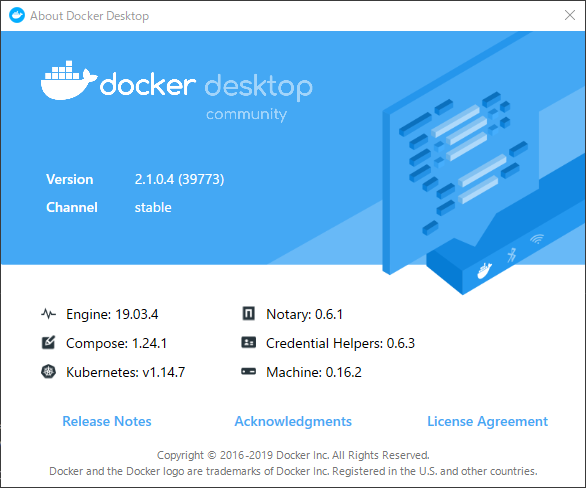
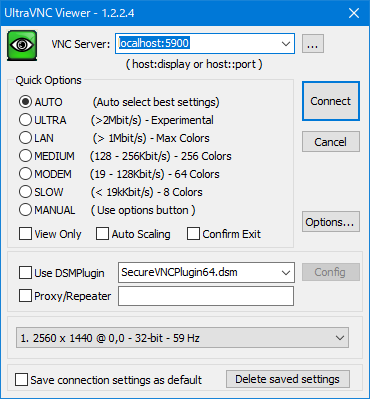
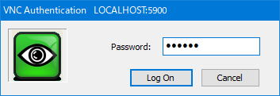
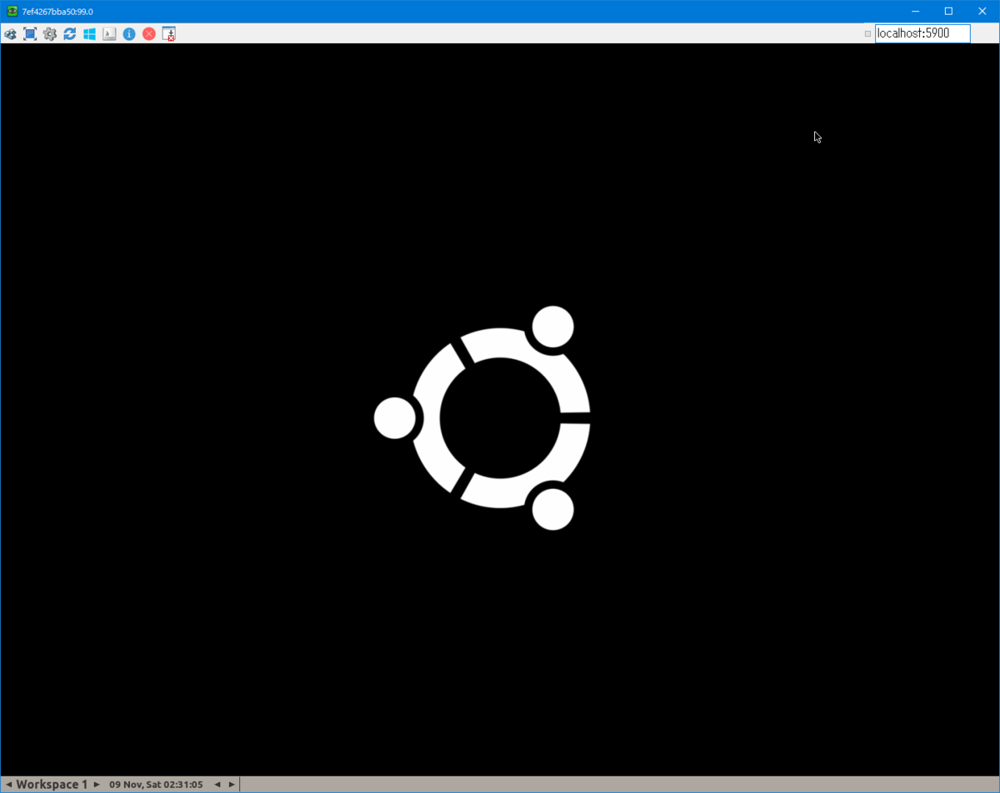
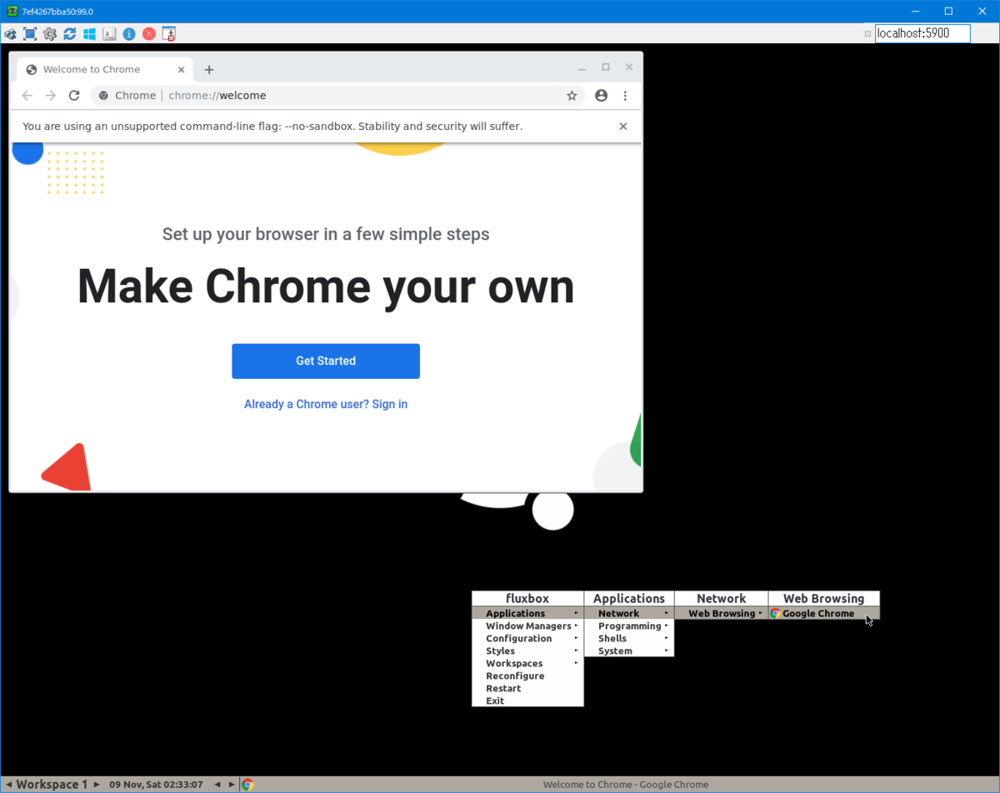
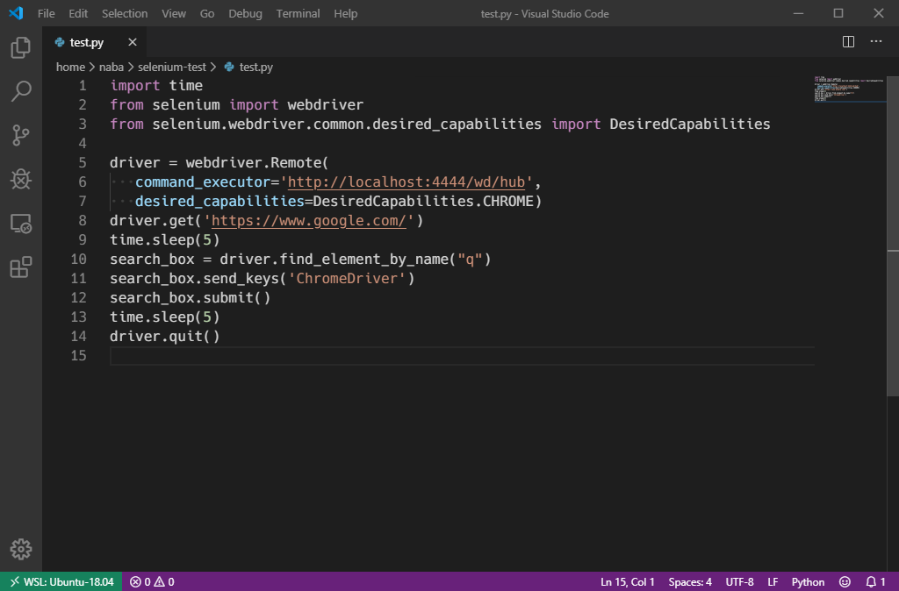

<div class="alert info">
はてなブログからの移行記事
</div>

# はじめに
この記事では、Windows 10 上の Docker で立ち上げた Selenium Server に対して、WSL (Windows Subsystem for Linux) 上で Python スクリプトを書いて Web スクレイピング環境を構築する手順を説明します。

## 免責
Web スクレイピングは法的にも関わってくるため、利用する際には対象の Web サイトの利用規約等を把握した上で自己責任で行ってください。  
Web スクレイピングについては、Wikipedia のリンクを貼っておきます。（[https://ja.wikipedia.org/wiki/%E3%82%A6%E3%82%A7%E3%83%96%E3%82%B9%E3%82%AF%E3%83%AC%E3%82%A4%E3%83%94%E3%83%B3%E3%82%B0](https://ja.wikipedia.org/wiki/%E3%82%A6%E3%82%A7%E3%83%96%E3%82%B9%E3%82%AF%E3%83%AC%E3%82%A4%E3%83%94%E3%83%B3%E3%82%B0)）

## 環境
* Windows 10 Pro 1903 (Windows 10 May 2019 Update)
  * Docker for Windows 2.1.0.4  

  * WSL
    * Ubuntu 18.04 LTS
    * Python 3.6.8
  * UltraVNC Viewer 1.1.24 (動作確認用)

# Selenium Server (Docker) の準備
Docker のインストールは省略します。

## コンテナ起動

Windows 上で docker コマンドが使えるところで、以下を実行してコンテナを起動します。
```
$ docker run -d -p 4444:4444 -p 5900:5900 selenium/standalone-chrome-debug:latest
7ef4267bba50ec1b80361325f10560502d8162c59acbc4688d34f26192154ec9
```

**docker ps** を叩き、コンテナが起動していることを確認します。
```
$ docker ps
CONTAINER ID        IMAGE                                     COMMAND                  CREATED             STATUS              PORTS                                            NAMES
7ef4267bba50        selenium/standalone-chrome-debug:latest   "/opt/bin/entry_poin…"   16 seconds ago      Up 15 seconds       0.0.0.0:4444->4444/tcp, 0.0.0.0:5900->5900/tcp   mystifying_williams
```

今回使用している Docker イメージは、Selenium 公式のもののうちの **standalone-chrome-debug** で、Selenium Server や、特定のバージョンの Chrome インストールされています。  
**-debug** がついているものは、VNCサーバーがついているようです。

また、Docker のポートフォワード機能で、以下を設定しています。

* 4444 : Selenium サーバー
  * Python スクリプトから Remote サーバーとして指定するために必要になります
* 5900 : VNC サーバー
  * Windows 上から UltraVNC Viewer を介してコンテナ内の Chrome の動作を確認するのに必要になります

このあたりの詳細は、GitHub を参考にしてください。
[https://github.com/SeleniumHQ/docker-selenium](https://github.com/SeleniumHQ/docker-selenium)

## VNC クライアントで Docker へ接続
VNC クライアントを使用することで、 Docker 内で実際にどのようにスクレイピングが行われているのか、  
実際の Docker 内の Chrome の画面を見ながら開発を行うことができます。

今回は、UltraVNC Viewer というソフトウェアを使用します。
[https://www.uvnc.com/](https://www.uvnc.com/)

インストール方法は割愛します。

起動して、ホスト名に **localhost:5900** を指定して、「Connect」を押下します。  


次に、Password を聞かれるので、**secret** を入力して、「Log On」を押下します。  


無事、Selenium Server のコンテナに接続することができました。  


画面内の適当な部分を右クリックすることで、アプリケーションメニューが開き、Chromeがインストールされていて、実行できることを確認できます。  


コンテナに接続できたら、そのまま置いておきます。

# WSL (Client) の準備

WSL のインストールについては例によって割愛します。

## Python のインストール
Python をインストールします（ない場合）。  
今回は WSL の環境として Ubuntu を使用しているので、**apt** を使用しています。
```
$ sudo apt install python3 pip3
```

## selenium モジュールのインストール
Python から Selenium を使用するために、モジュールをインストールします。
```
$ pip3 install selenium
```

## テストスクリプトの準備
WSL 上で、スクリプトを作成します。  
直接 WSL Terminal から vim などで作成しても良いですが、
今回は、Visual Studio Code の Remote Development 機能を使用して作成を行いました。

Visual Studio Code の Remote Development については、検索するとたくさん出てくるかと思います。  
以下に、 Microsoft 公式ドキュメントを貼っておきます。
[https://code.visualstudio.com/docs/remote/wsl](https://code.visualstudio.com/docs/remote/wsl)

適当なスクリプトを作成し、以下を入力してください。
```python
import time
from selenium import webdriver
from selenium.webdriver.common.desired_capabilities import DesiredCapabilities

driver = webdriver.Remote(
   command_executor='http://localhost:4444/wd/hub',
   desired_capabilities=DesiredCapabilities.CHROME)
driver.get('https://www.google.com/')
time.sleep(5)
search_box = driver.find_element_by_name("q")
search_box.send_keys('ChromeDriver')
search_box.submit()
time.sleep(5)
driver.quit()
```



5行目～7行目の
```python
driver = webdriver.Remote(
   command_executor='http://localhost:4444/wd/hub',
   desired_capabilities=DesiredCapabilities.CHROME)
```
で、Selenium Server に接続する設定を指定します。

* **command_executor** には、Selenium Server のIP、ポート、エンドポイントを指定
* **desired_capabilities** には、スクレイピングを行う Web ブラウザの種類を指定

このたりは、以下のサイトで詳しく見れます。
[https://selenium-python.readthedocs.io/getting-started.html#simple-usage](https://selenium-python.readthedocs.io/getting-started.html#simple-usage)

# スクレイピングテスト
WSL 側でスクリプトを実行すると、コンテナ内で自動で Chrome が立ち上がって想定通りの動作をすることが確認できます。  


# まとめ
* Selenium サーバーが Docker コンテナ側にあることで、特定のバージョンの Chrome でのテストなどがしやすく、別の環境に持っていくことも簡単になる

# 参考
* [https://qiita.com/memakura/items/20a02161fa7e18d8a693](https://qiita.com/memakura/items/20a02161fa7e18d8a693)
* [https://qiita.com/yutachaos/items/4a1da5d55a3bf0df889e](https://qiita.com/yutachaos/items/4a1da5d55a3bf0df889e)
* [https://qiita.com/reflet/items/8f541edde58d635daac4](https://qiita.com/reflet/items/8f541edde58d635daac4)
