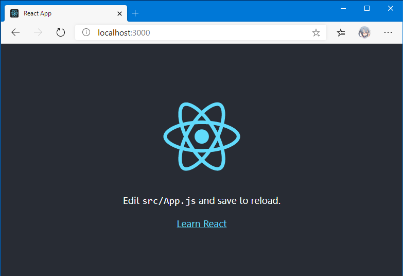
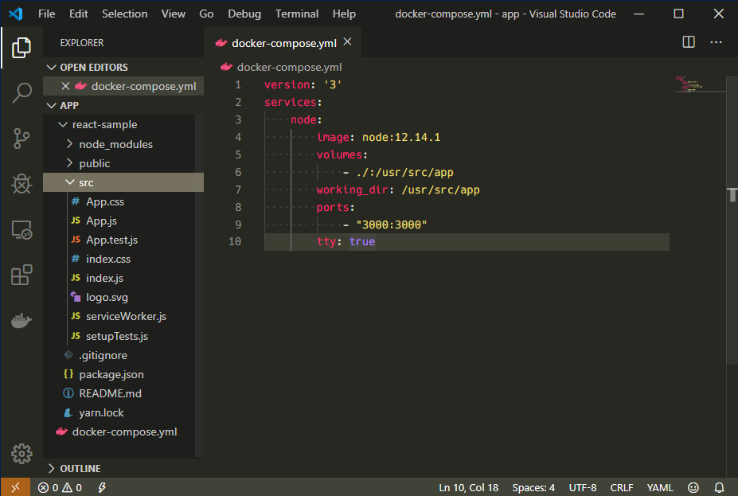

<div class="alert info">
はてなブログからの移行記事
</div>

# はじめに

React の開発環境構築として、実行環境を node の Docker コンテナを使用することにしたので、構築手順をまとめます。  
今回覚えながら docker-compose を使用したので、理解の間違いなどがあれば指摘いただけると嬉しいです。

## 環境

* Windows 10 Pro (2004)
* Docker for Windows 2.2.0.0

## 完成イメージ

<figure class="figure-image figure-image-fotolife" title="完成形イメージ">[f:id:naba0123:20200126224944j:w500]<figcaption>ホストOSとコンテナでは、ソースコードと、3000番ポートを共有している</figcaption></figure>

# docker-compose.yml の作成

作業ディレクトリを作成したら、まず ** docker-compose.yml ** を作成します。  
** docker-compose.yml ** を使用することで、通常 `docker` コマンドに色々引数やらつけなくちゃいけないものを、一元管理することができます。  
また、実行する際も `docker-compose` コマンドを使用します。
```yaml
version: '3'
services:
    node:
        image: node:12.14.1
        volumes:
            - ./:/usr/src/app
        working_dir: /usr/src/app
        ports:
            - "3000:3000"
        tty: true
```

* ** version ** : docker-compose で使用するバージョンになります。  
ドキュメント：[https://docs.docker.com/compose/compose-file/](https://docs.docker.com/compose/compose-file/)
* ** services ** : ** version ** と同じインデントに記載します。  
※参考記事ではインデントを深くしており、そのまま真似てしまうとエラーになってしまいました。（気付くまで時間がかかった）
  * ** node ** : ** services ** で定義するサービス名です。何でも良いですが、`docker-compose up サービス名` のように使用するので、分かりやすい名前にしておきます。  
今回は、使用するコンテナのイメージが node なので、定義する名前も node にしておきます。
    * ** image ** : ** node ** サービスで使用するイメージ元です。  
今回のように直接 image を指定することもあれば、 ** build ** セクションを記載して、`docker-compose build` でイメージをビルドしてから起動する方法もあります。
    * ** volumes ** : ホストOSと共有するディレクトリになります。  
コロンより前がホスト側のパス（ `docker-compose` を実行するディレクトリからの相対パスとして、自身のディレクトリを指定）、後がコンテナ内のパスです。
    * ** working_dir ** : コンテナ内でコマンドを実行する際の、起点となるディレクトリです。  
今回は、後ほど `docker-compose exec node /bin/bash` でコマンド内で作業をするので、そのログイン時のはじめのディレクトリを指定しておきます。
    * ** ports ** : ホストとコンテナでポートフォワードを行うポートを指定します。  
コロンより前がホスト側、後がコンテナ側で、今回はコンテナ内で3000ポートで動いているアプリケーションに、ホストの3000を割り当てています。  
これにより、Reactアプリケーションの起動後に http://localhost:3000/ でアクセスができるわけです。
    * ** tty:true ** : これを書いておくことで、`docker-compose up` 後に実行するコマンドがなく即コンテナが終了することなく、待機状態となります。  
ドキュメント：[https://docs.docker.com/compose/compose-file/#domainname-hostname-ipc-mac_address-privileged-read_only-shm_size-stdin_open-tty-user-working_dir](https://docs.docker.com/compose/compose-file/#domainname-hostname-ipc-mac_address-privileged-read_only-shm_size-stdin_open-tty-user-working_dir)

# コンテナ起動

docker-compose.yml を作成したら、コンテナを起動します。
```
$ docker-compose up
Creating network "app_default" with the default driver
Pulling node (node:12.14.1)...
12.14.1: Pulling from library/node
146bd6a88618: Pull complete
9935d0c62ace: Pull complete
db0efb86e806: Pull complete
e705a4c4fd31: Pull complete
c877b722db6f: Pull complete
645c20ec8214: Pull complete
72851fd0a9e4: Pull complete
c97d6cf2691b: Pull complete
7df0baa2324d: Pull complete
Digest: sha256:0a68eb463c4ab4db0833c786cc484ea2edfd50e73e606380e30b806aeb9eee5a
Status: Downloaded newer image for node:12.14.1
Creating app_node_1 ... done
Attaching to app_node_1
node_1  | Welcome to Node.js v12.14.1.
node_1  | Type ".help" for more information.
```
初回は、** node:12.14.1 ** イメージをダウンロードするので pull したりするログが流れますが、最後に node が起動してるっぽいログが出てきたらOKです。  

今回実行した `docker-compose up` は、docker-compose.yml に記載されているサービスを全部起動するという処理になっています。  
今回 services には node しか書いていませんので `docker-compose up node` と同義となります。

ただし、現在フォアグラウンドで実行中、かつ何も動作をしない状態なので、これ以上動けず、ログを吐き出し続けます。  
一度「Ctrl+C」でコンテナを終了（フォアグラウンドで実行しているものを停止させるので、この場合はコンテナも停止します）させるか、別のターミナル（ PowerShell など）を立ち上げて、次の作業を行ってください。

バックグラウンドでの実行（`docker-compose up -d`）後、またはフォアグラウンドで実行中に別のターミナル（ PowerShell ）でコンテナが起動していることを確認します。
```
$  docker-compose ps
   Name               Command            State           Ports
-----------------------------------------------------------------------
app_node_1   docker-entrypoint.sh node   Up      0.0.0.0:3000->3000/tcp
```

# コンテナ内で React アプリを作成する

実行中のコンテナに入るには、`docker-compose exec` を使用します。
```
$ docker-compose exec node /bin/bash
root@cf0b2b9f6a64:/usr/src/app#
```
無事にコンテナ内に入り、はじめの作業ディレクトリが、先程 docker-compose.yml で指定した ** /usr/src/app ** になっていることがわかります。

次に、react アプリを作成します。  
node のイメージを使用しているので、node はもちろん入っています。  
** react-sample ** という名前で新規の React アプリを作成します。  
create-react-app は結構時間がかかります（私の環境では20分ぐらい）。のんびり待ちましょう。
```
root@cf0b2b9f6a64:/usr/src/app# node --version
v12.14.1
root@cf0b2b9f6a64:/usr/src/app# npm --version
6.13.4
root@cf0b2b9f6a64:/usr/src/app# yarn --version
1.21.1

root@cf0b2b9f6a64:/usr/src/app# npm install -g create-react-app
/usr/local/bin/create-react-app -> /usr/local/lib/node_modules/create-react-app/index.js
+ create-react-app@3.3.0
added 91 packages from 45 contributors in 6.867s

root@cf0b2b9f6a64:/usr/src/app# create-react-app react-sample
～長い～
※最後に Success とか出てくる
```

# React アプリの実行

React アプリの実行は、`yarn` コマンドを使用します。  
`yarn` は `npm` については、検索するといろんな記事が出てきます。
[https://www.d-wood.com/blog/2017/05/25_8979.html](https://www.d-wood.com/blog/2017/05/25_8979.html)

```
$ cd react-sample
$ pwd
/usr/src/app/react-sample

$ yarn start
※以下は出力（出力に$とか入ってるので念の為）
yarn run v1.21.1
$ react-scripts start
Compiled successfully!

You can now view react-sample in the browser.

  Local:            http://localhost:3000/
  On Your Network:  http://172.22.0.2:3000/

Note that the development build is not optimized.
To create a production build, use yarn build.
```


これで React アプリが起動しました。  
ホストPCとは3000ポートがすでにフォワーディングされていますので、ブラウザで ** http://localhost:3000/ ** にアクセスすると、 React の Welcome ページが出てくるはずです。お疲れさまでした！

`yarn start` についてですが、今回のようにいちいちコンテナに入って打つよりも、参考記事にあった  
「docker-compose.yml 内に起動時のコマンドとして `cd react-sample && yarn start` を指定する」  
という方法もあるようですが、私の環境では1回目は成功するのですが、一度落として再度 ** docker-compose up **しようとすると、  
```
Error: ENOENT: no such file or directory, uv_cwd
```
のようなエラーが出てきてしまい実行できない、という状況になってしまいました。  
（調べてみるとどうやら node.js のエラーらしいです）  
ちなみにこれは Docker for Windows を再起動することで一応直るのですが、毎回立ち上げ直すのが手間で、「コンテナ内から実行したらエラーが起きない」ということに気づいたので、今回の形となりました。

# 環境構築直後のディレクトリ構造



# 参考

* [https://blog.web.nifty.com/engineer/2714](https://blog.web.nifty.com/engineer/2714)
* [https://qiita.com/yuta-ushijima/items/d3d98177e1b28f736f04](https://qiita.com/yuta-ushijima/items/d3d98177e1b28f736f04)
* [https://unskilled.site/%E4%BD%BF%E3%81%84%E6%96%B9%E5%9F%BA%E6%9C%AC%E7%89%88dockercompose%E3%81%A7%E3%82%B3%E3%83%B3%E3%83%86%E3%83%8A%E7%AB%8B%E3%81%A1%E4%B8%8A%E3%81%92%E3%83%BB%E9%80%A3%E6%90%BA%E3%82%92%E6%A5%BD/](https://unskilled.site/%E4%BD%BF%E3%81%84%E6%96%B9%E5%9F%BA%E6%9C%AC%E7%89%88dockercompose%E3%81%A7%E3%82%B3%E3%83%B3%E3%83%86%E3%83%8A%E7%AB%8B%E3%81%A1%E4%B8%8A%E3%81%92%E3%83%BB%E9%80%A3%E6%90%BA%E3%82%92%E6%A5%BD/)
